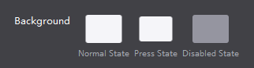
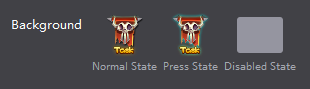
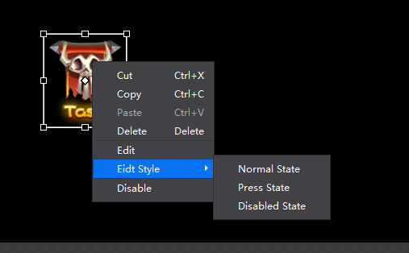

# 3.2.4.2 指定资源引用

在游戏开发中，设置控件的资源引用（使用设计师的美术资源）是一件最为基本和必要的操作。Cocos Studio提供了三种方式，方便用户轻松快速的指定资源的引用。同样，我们以之前的按钮控件“首页”附加背景样式属性，来说明这三种方式操作。

####通过属性面板设置
在控件属性面板中，找到该控件指定资源引用的属性值“背景样式”（其他控件的“按钮样式”,图片控件的“图片资源”等也是引用类型）

双击“正常状态”图标，在弹出的对话窗口中选择需要设置的资源，点击“打开”完成对属性“正常状态”的资源引用。

####控件右键菜单设置
下面我们通过另一种方式设置属性“按下状态”。

在画布面板选择按钮控件“首页”，单击鼠标右键（次键），弹出菜单

选择菜单项“设置按钮样式——按下状态”，同样在弹出的对话窗口中选择需要设置的资源，点击“打开”完成对属性“按下状态”的资源引用。

部分控件支持右键菜单快速指定资源引用的操作。例如图片控件，当用户添加一图片控件后，点击鼠标右键（次键）开启控件菜单，选择“设置图片资源”后，选取所需资源（对图片控件，资源为.PNG.JPG类型文件）后，点击确定按钮完成资源引用（用户可以磁盘中任何资源，Cocos Studio用自动判断资源是否已存在项目中，若存在这直接引用，若不存在，则会将资源拷贝到项目目录中，并在资源面板的项目名称节点后添加被引用的资源，在完成资源引用）。

目前支持此功能的控件有：按钮（设置按钮样式）,复选框（设置复选框样式）,精灵（设置精灵资源）,图片(设置图片资源),艺术数字（设置标签样式）,FNT字体（设置FNT字体资源）,进度条（设置进度条样式）,滑动条（设置滑动条样式）,粒子（设置粒子文件）,地图（设置地图文件）,声音（设置声音文件）。

查看每种控件详细的菜单项以及对应的内容，请参考如何使用控件。

####快速拖拽资源设置
同样的，我们可以通过拖拽的方式更快速的为控件设置资源引用：拖拽资源面板资源至属性面板对应属性上即可。

