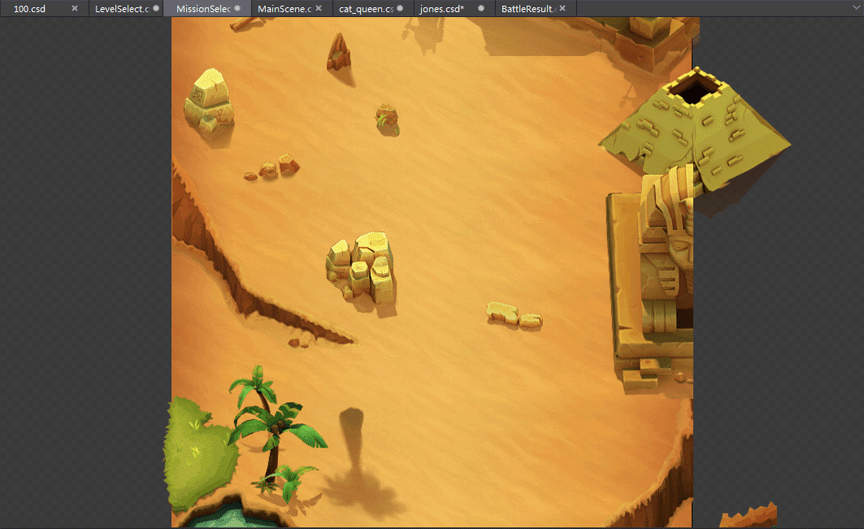
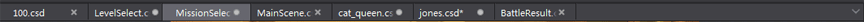
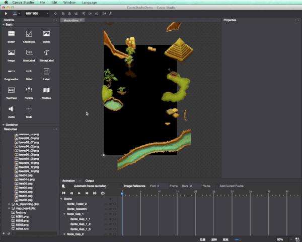
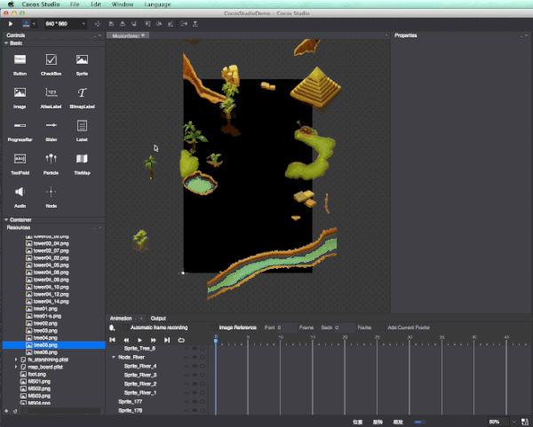

# 3.2.3.2 使用画布面板

画布面板是游戏制作的重要区域，您可以在画布面板编辑场景,调整控件,实时预览，从整体把握游戏进度。

您可以新建一个文件，或者打开已有文件，当前打开文件会显示在画布面板上，同时以往打开文件会在画布面板标签页中保留，您可以方便的切换到不同文件进行编辑和浏览操作。

需要注意的是，在本章第一节中详细介绍了游戏项目可以创建的四种文件类型-场景,图层,节点,合图。这些文件都会显示在画布面板，以不同标签页区分。其中场景,图层,节点三种文件支持添加控件和调整控件操作；合图文件不支持。

####添加控件
我们已官方示例中任务选择界面（MissionSelect.csd）中背景为例，当您在拼接背景时，希望像图中添加一些植被，您可以这样操作

(1)拖拽添加控件

a) 在控件面板选取控件，拖拽至画布面板；

b) 在项目管理器选取资源，拖拽至画布面板。目前仅支持Cocos Studio文件类型（.csd）和图片类型（.png .jpg）资源；
c) 从磁盘目录选取资源，拖拽至画布面板。目前仅支持图片类型（.png .jpg）资源。 

(2)右键添加控件
    
对于容器控件，支持右键菜单向其添加子控件。 

####调整控件
我们已经添加了控件，现在将它们摆放到合理的位置

1. 单选调整控件

	画布中的控件需要进行调整来实现效果，对于单个控件可以进行的操作有：

	添加资源：从资源区选择资源，拖动至控件，鼠标放开即完成添加；

	删除控件：有两种方式：(1)点击键盘“Delete”键，(2)右键选择“删除”；

	移动：鼠标位于控件内，当鼠标出现时，点击拖动可移动控件。按住Shift支持水平或垂直移动；支持键盘“上下左右”微调控件位置；     

	缩放：鼠标位于控件八个顶点，当鼠标出现时，点击拖动完成缩放。按住Shift支持宽高等比缩放；

	旋转：鼠标位于控件四个对角顶点外侧，当鼠标出现时，点击旋转至所需角度。按住Shift支持单次旋转15度角；

	倾斜：鼠标位于控件四条边上，当鼠标出现时，点击拖动可实现倾斜；

	移动锚点：鼠标位于控件锚点上，当鼠标出现时，点击拖动可改变锚点位置；

	右键：在控件上点击右键会展示右键菜单，所有控件均有“剪切,复制,粘贴,删除”四个基础项。不同控件在基础项下方还有不同的特殊项，可以对控件操作。 

2. 多选调整控件

	多选控件有两种方式：

	(1)按Command（Windows版本按Ctrl）的同时单击多个控件

	(2)在画布拉取选择框，框选多个控件。    
 	多选控件将作为一个整体操作：删除,移动,缩放,旋转,倾斜。    

 	多选控件的右键菜单有“剪切,复制,粘贴,删除,对齐方式”，其中对齐方式提供九种类型：中心对齐,上对齐,垂直居中,下对齐,左对齐,水平居中,右对齐,水平分布,垂直分布。 
