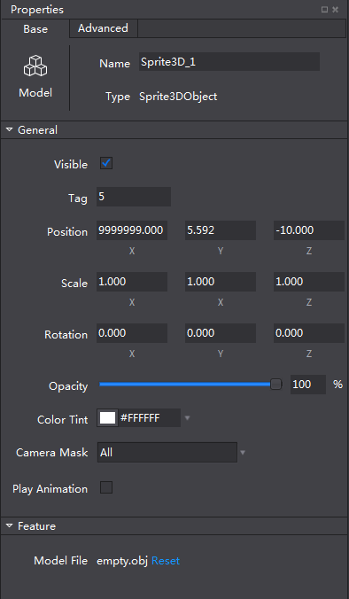

#3.3.4.1 Basic properties

As the above picture shows, when users manually edit property settings, the objects on the canvas will be synchronized. Data type of coordinate axes, scaling and rotation is float. The settings of opacity range from 0 to 100%, reflecting the strength of transparency. When the “Visibility” checkbox is selected, the objects in the view is visible, otherwise the objects are hidden.

In addition to the basic properties, there are additional settings for some objects. 
