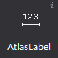
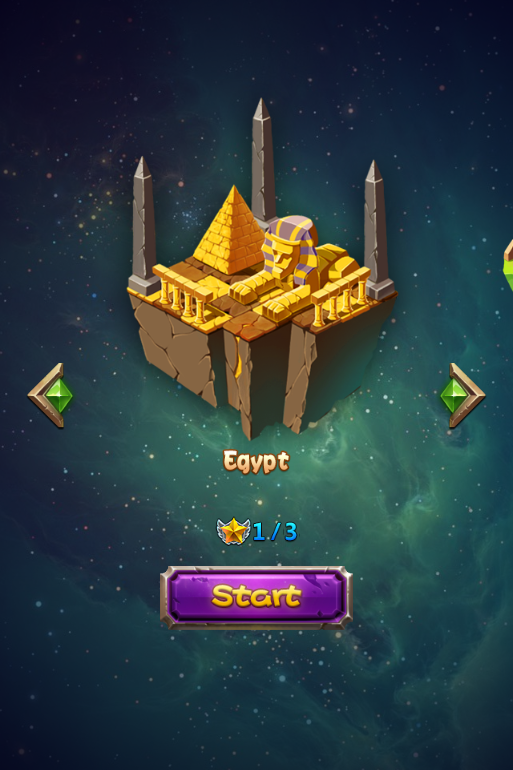
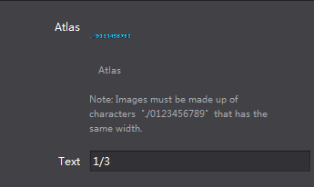
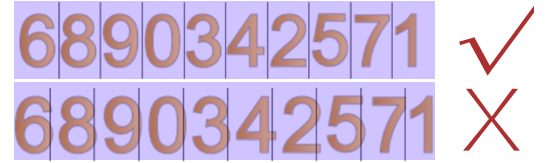

# 3.3.1.5 艺术数字

 

可以通过一张从0到9的PNG图片实现艺术数字的效果，每个数字的高为图片的高，宽为图片的1/10，通过艺术数字可以实现艺术化效果的数字，能够简单有效的丰富游戏的视觉效果。
和FNT字体相比，艺术数字具有以下特性：

1.	制作方便，FNT字体制作复杂，而艺术数字较简单
2.	可用资源少，艺术数字仅支持0-9的数字

#### 使用场景
我们的官方示例中，选择关卡这里就使用了艺术数字
  

#### 场景1：修改艺术数字图片资源
在画布上添加一个艺术数字后，选择该艺术数字控件，在属性面板的特性部分会展示控件当前的图片资源缩略图，您可以通过双击缩略图修改控件的图片资源，也可以将图片资源拖动到当前的样式资源上以替换为新的资源。
除此之外也能通过艺术数字控件的右键菜单添加新的资源。
修改按钮文本时只需选中按钮，在属性区修改文本属性，也可以通过“菜单-编辑文本”或双击唤出修改文本弹窗。
  

#### 特别说明
制作艺术数字时需要游戏美术设计人员提供一张包含了“0”到“9”的图片，确保顺序为0-9且按照图片宽度进行10等分能够分割出各个独立的数字。
 

一张典型的艺术数字图片资源

 

如果您需要输入除了数字以外的其他字符请参考[FNT字体控件](../bitmaplabel/zh.md)。
