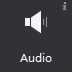

# 3.3.1.13 声音

声音是控制音乐与音效的控件。在游戏制作时，声音对表现效果有至关重要的作用。Cocos Studio声音控件支持mp3,wav两种格式的音效文件。

#### 使用场景

在官方示例的胜利界面中，我们使用了声音控件来作为胜利的音效，您可以获取[官方示例]()进行查看

#### 场景1：导入文件

您可以为声音导入特定效果的文件(mp3/wav文件)：

1. 从资源面板拖动文件至声音控件，松开鼠标即实现文件导入；
2. 在属性面板的“特性”中，点击“导入声音文件”按钮，选择文件导入；
3. 在画布中选中粒子控件右键选择“设置声音文件”，选择文件导入。

#### 场景2：能否让音效循环播放

勾选特性-循环播放“支持”项时，在实际游戏项目中声音文件将会循环播放，未勾选时，声音文件只播放一遍即停止。

