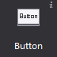
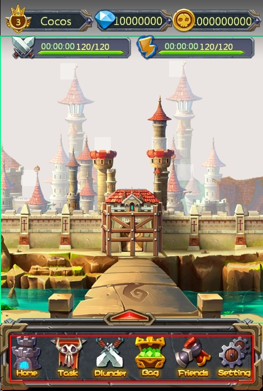
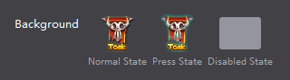
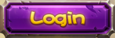

# 3.3.1.1 按钮

按钮是游戏中最常用的控件类型之一，控制用户点击事件的开关，有正常,按下,禁用三种状态，您可以为他们设置样式及文本。

#### 使用场景
按钮的使用十分普遍，以官方示例中的界面为例，画框的内容均是由按钮控件组成

甚至在您的项目中，界面上方的等级,钻石,钱币也可以由按钮控件组成，当用户触摸时，跳转至相应的界面。

按钮控件属性众多，除了常规属性外，还包含尺寸属性和一些特性属性，我们从经常使用按钮控件的几种场景为您介绍如何更好的使用这种控件
#### 场景1：修改按钮背景，设置按钮按下后效果和禁用效果
按钮具有三种状态，每一种状态都可以通过图片来定义。

例如实现下图的按钮

您只需要在画布上添加一个按钮后，选择该按钮控件，在属性面板的特性部分会展示按钮控件当前的样式资源，您可以通过双击修改按钮控件的属性，也可以将图片资源拖动到当前的样式资源上以替换为新的资源。我们为按钮设置了正常和按下状态，这样在游戏中触摸该按钮时，按钮就会自动切换为按下状态的图片。如果有需要，您也可以为按钮设置禁用状态。

除此之外也能通过按钮控件的右键菜单添加新的资源。
#### 场景2：使用按钮时，需要在按钮上设置文字

有时我们在设置按钮样式后，还希望给按钮设置文字，您可以使用修改按钮文本特性来实现这个需求。您可以自定义按钮文本的颜色,字体,大小。

修改按钮文本时只需选中按钮，在属性区修改文本属性，也可以通过“菜单-编辑文本”或双击唤出修改文本弹窗。

#### 场景3：在游戏中，不希望该按钮响应用户的触摸事件
能够在属性面板或右键菜单设置按钮是否启用，按钮禁用后在最终的游戏里将不能响应触摸事件。
