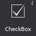
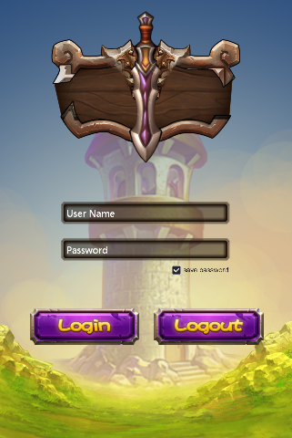
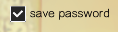

# 3.3.1.2 复选框

 

复选框是一种可同时选中多项的基础控件，您可设置他的各种样式，以及选中状态。

#### 使用场景
复选框最常用的地方莫过于游戏登录界面上的“记住用户名”和“记住密码”，相信您一定经常见到。

  

还有就是一些游戏的设置界面，控制是否启用音乐的开关，通常也是复选框控件。
复选框控件属性众多，除了常规属性外，还包含尺寸属性和一些特性属性，我们从经常使用复选框控件的几种场景为您介绍如何更好的使用这种控件。

#### 场景1：修改复选框样式
复选框具有五种状态：背景正常样式,背景按下样式,背景禁用样式,选中标识样式,选中标识禁用样式，每一种状态都可以通过图片来定义。
如果您要实现常规复选框的样式，如下图：

  

您可以分别设置五个状态的图片，已达到您的预期效果
如果您要实现设置界面的音乐开（关）样式，如下图 ：

 
您仅需要设置背景正常样式,背景按下样式,背景禁用样式，而将另外两个状态设置为不启用状态。
除此之外也能通过按钮控件的右键菜单添加新的资源。

#### 场景2：游戏中默认复选框是勾选（不勾选）的。
当您设置一个复选框为选中时，这个复选框在游戏中的初始状态就为选中的状态。
通过属性面板或右键菜单能够修改复选框的选中状态。

