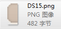

# 3.3.1.4 图片

 
 

添加一张可以设置九宫格的图片，九宫格是一种能够使本来拉伸后会失真的图片，经过一定的处理后，拉伸后不失真的技术。关于九宫格的用法请参考[如何使用九宫格](../../../chapter2/properties/scale-9-slice/zh.md)

图片控件相对于精灵控件，具有以下特性：

1.	可改变原图尺寸，而不出现图片失真效果。

2.	可使用同一资源，通过设定九宫格的参数，达到不同的最终效果。

3.	系统开销比精灵控件大，建议不要过度使用图片控件。

#### 使用场景
同样还是官方示例中的这个界面，您能想象到哪些地方是由图片控件组成的么？
  
 

您可以获取官方示例后，打开DifficultSelect.csd文件查看我们是如何使用图片控件的，也许会对您的项目有所启发。
其中的背景由一张尺寸为16x32的图片制作而成的。下面我们为您说明如何使用图片控件制作这一背景。
#### 场景1：如何使用图片控件

 

在画布上添加一个图片控件后，设置其“图片资源”属性为上图所示资源，设置方式为在属性面板的特性部分会展示控件当前的图片资源缩略图，您可以通过双击缩略图修改控件的图片资源，也可以将图片资源拖动到当前的样式资源上以替换为新的资源。除此之外也能通过九宫格图片控件的右键菜单添加新的资源。
然后开启“九宫格”属性，并修改九宫格控件的上下左右边距分别为0,0,10,0，而后修改控件尺寸为70,32，定义的这些边距会影响九宫格拉伸的效果，并达到预期的效果。关于九宫格的原理和详细说明，详见[如何使用九宫格](../../../chapter2/properties/scale-9-slice/zh.md)。
