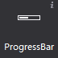
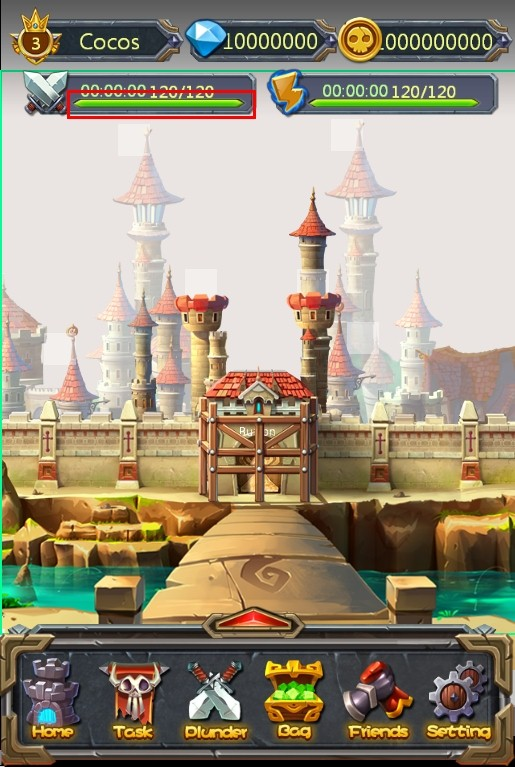
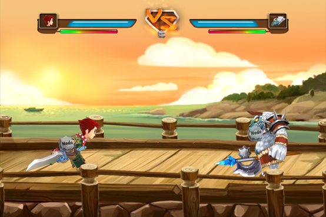

# 3.3.1.7 进度条

 

通过进度条可以显示处理任务的速度,完成度，您可以设置进度条的样式。

#### 使用场景
官方示例中，体力恢复功能就使用了进度条控件，如下图所示绿色条
  

#### 场景1：修改进度条样式
在画布上添加一个进度条后，选择该进度条控件，在属性面板的特性部分会展示进度条控件当前的样式资源，您可以通过双击修改进度条控件的资源图，也可以将图片资源拖动到当前的样式资源上以替换为新的资源。
除此之外也能通过进度条控件的右键菜单添加新的资源。
如示例中，我们就为其设置了如下背景：
 

#### 场景2：设置进度条方向

 
实现如上图所示血条（一个向左，一个向右），只需要设置进度条的属性“类型”，分别设定为从左至右,从右至左，通过修改进度条方向可以在游戏中实现对战时生命值的展示。

