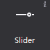
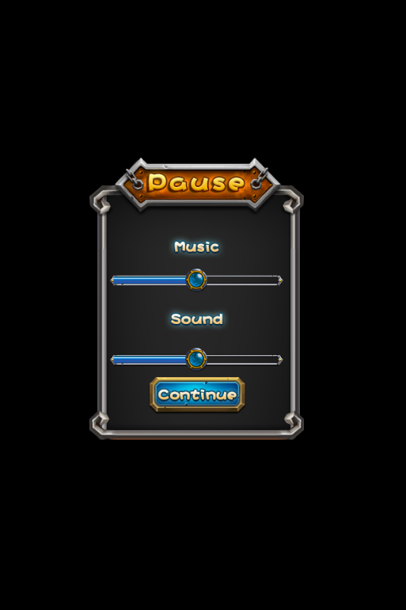
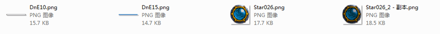
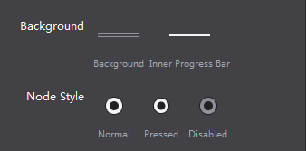

# 3.3.1.8 滑动条

 

滑动条可以设置滑动进度，滑块样式式等，用户可通过移动滑动滑动条在相应的控件中显示对应的值

#### 使用场景
滑动条多用于设置某些连贯属性上，如在很多程序中的设置界面设置音量等，在官方示例中，我们也在设置界面做了滑动条的展示：
  

#### 场景1：修改滑动条样式
如上图，要设置上图中的进度条，您需要以下五个资源，他们分别用于设置滑动条的背景样式,内部进度条样式,滑块正常样式,滑块按下样式,滑块禁用样式，每一种状态都可以通过图片来定义。在我们的示例中，禁用状态没有设置。
   

在画布上添加一个滑动条后，选择该滑动条控件，在属性面板的特性部分会展示滑动条控件当前的样式资源，您可以通过双击修改滑动条控件的属性，也可以将图片资源拖动到当前的样式资源上以替换为新的资源。
   

除此之外也能通过滑动条控件的右键菜单添加新的资源。

