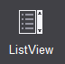
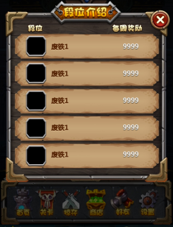

# 3.3.2.3 列表容器

列表容器是一个能够自动排列控件的容器。

注意：*当一个控件被添加到列表容器后，它的坐标将无法修改。*

#### 使用场景

列表容器常被用于游戏中关卡列表等具有列表效果的场景中。

#### 场景1：如果不显示容器外的内容

当容器上的控件有超出容器的部分时，可以通过属性“裁切内容”使超出部分将被隐藏，不予显示。

#### 场景2：自定义列表容器显示方式

列表容器实现列表效果只需要为列表容器添加子控件，通过设置列表滚动方向,子控件对齐方式,子控件间隔等属性可以决定列表容器对子控件布局的影响从而实现横向或纵向滚动的列表。

