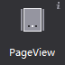
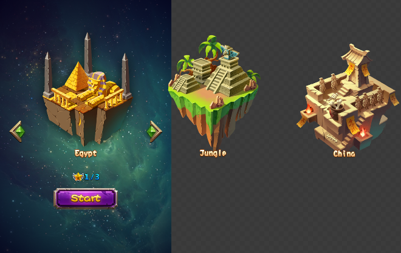
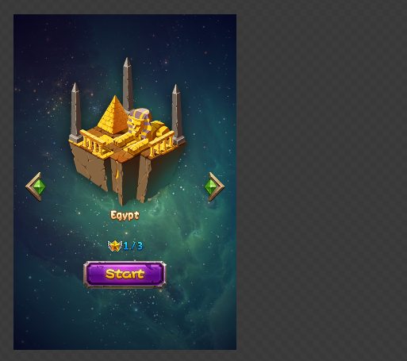

# 3.3.2.4 翻页容器

翻页容器是一个具有翻页效果的容器，只能添加基础容器。

#### 使用场景

翻页容器常被用于游戏中背包等具有翻页效果的场景中，在官方示例中，我们就在选择关卡界面，应用了翻页容器，来切换不同的关卡。

 

#### 场景1：如果不显示容器外的内容

当容器上的控件有超出容器的部分时，可以通过属性“裁切内容”使超出部分将被隐藏，不予显示。如上图，我们勾选属性后，效果如下：

 

#### 场景2：如何添加翻页效果

翻页容器实现翻页效果实际上是为其添加基础容器子控件，然后在子控件中设置内容，最后在实际运行中，翻页容器会自动将自己与子控件统一使用。要添加子控件，你在画布中选中控件后右键进行添加，或者手动将基础容器作为翻页容器的子控件，值得注意的是您只能添加基础容器作为他的子控件。

当一个控件被添加到滚动容器后，它的坐标,缩放,旋转,锚点,尺寸都会恢复默认并无法修改，也无法修改这个控件的布局方式。
