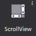
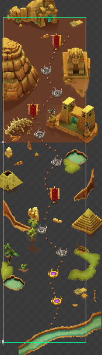
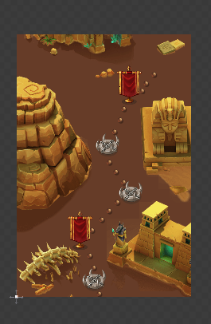
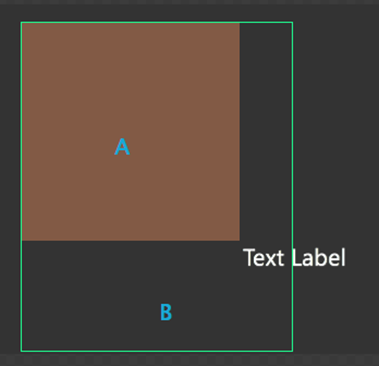
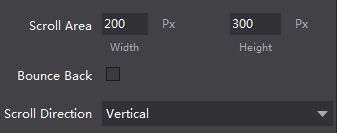

# 3.3.2.2 滚动容器

滚动容器可以实现触屏上的滚动效果，能够设置滚动区域,滚动方向等属性。

#### 使用场景

在官方示例中，我们特意在任务选择界面（MissionSelect.csd）中，设置了滚动层容易，用来表示关卡的地图背景。我们将关卡背景设置为3个屏幕高度大小，实际运行中，用户可以上下滑动屏幕来查看整张地图。

#### 场景1：如果不显示容器外的内容

当容器上的控件有超出容器的部分时，可以通过属性“裁切内容”使超出部分将被隐藏，不予显示。如上图，我们勾选属性后，效果如下：

#### 场景2：如何设置滚动容器的可滚动尺寸

在使用滚动容器时A为滚动容器的尺寸，当设置滚动容器为裁切时，A以外的区域即B区域将不予显示，但B区域的内容可以通过滚动到A区域展示出来，内容尺寸是指所有通过滚动展示的内容，即B与A的范围，图中的文本有一部分在滚动内容外这部分即使通过滚动也无法展示。滚动内容尺寸不能比容器尺寸小。

您可以在这里选择需要的容器滚动方向：水平,垂直,水平与垂直。

#### 场景3：如何设置回弹效果

当滚动容器滑至屏幕边界时，继续滑动，界面会有一个反弹效果。为达到这一效果，您只需要勾选滚动容器控件的属性“回弹效果”，系统就会为您在游戏中实现这个效果。