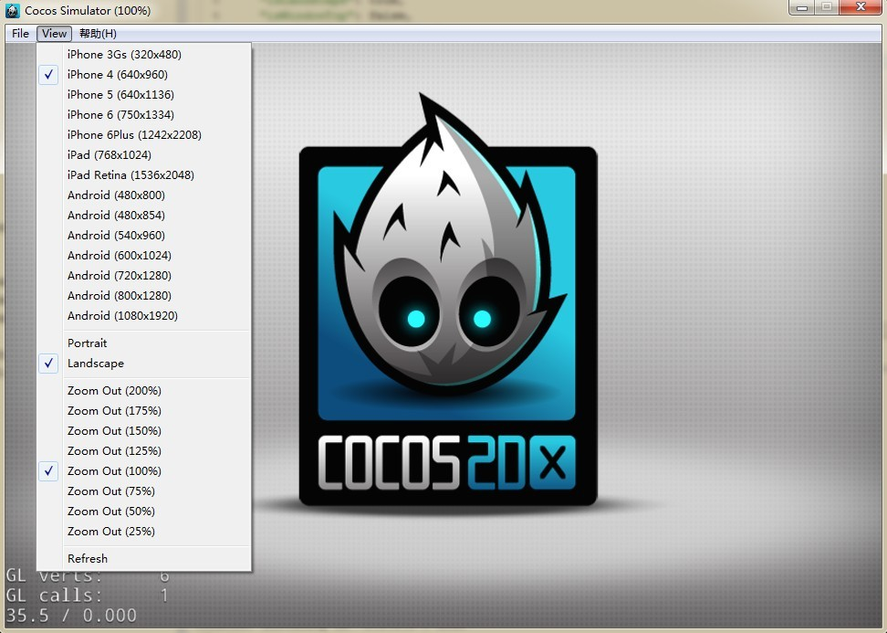
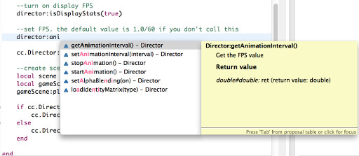
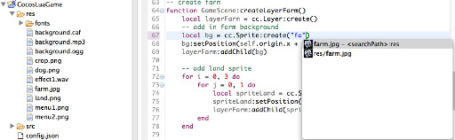
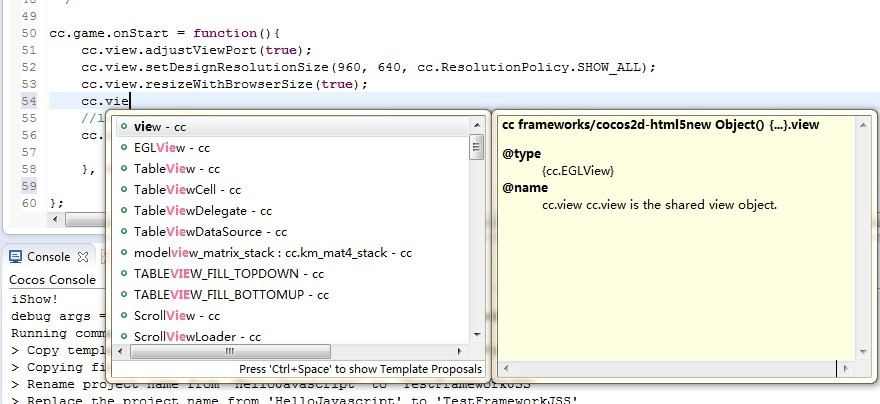
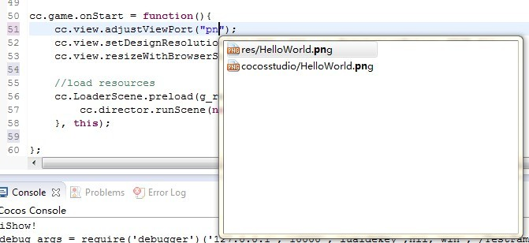

4.1 编辑游戏代码
=======

接下来就可以编写游戏逻辑了。在此之前，先来了解一下新工程自带的示例代码的逻辑。

-------------------
一.Lua工程
---------

1. 工程目录下有一个名字为config.json的配置文件，可以在Code IDE中双击打开。配置中"entry"字段设置了游戏的入口文件为"src/main.lua"。 

        {
            "init_cfg": {
            ...
            "entry": "src/main.lua",
            ...
            },
            ...
        }
  
2. 双击打开"src"目录下的"main.lua"文件，里面主要定义了"main"函数，然后在文件最后开始执行"main"函数，开始游戏执行。

3.  "main.lua" 里的主要内容是载入配置文件和框架初始化文件，然后定义了一个名为 `main` 的入口函数。

为了捕获游戏运行中的错误，并输出错误信息，我们用 `xpcall()` 来封装了对 `main` 函数的调用。`main` 函数则负责载入 `app.MyApp` 类，并构造实例开始运行整个游戏。

游戏启动后，会载入 `app/views/MainScene.lua` 文件。这个文件创建了我们的游戏场景，并开始运行游戏逻辑。

 
4. 可以在模拟器的菜单中选择不同的分辨率，查看游戏在不同分辨率的屏幕上的表现效果。模拟器的窗口初始大小是在config.json中配置的,其属性为width和height。  

        {
            "init_cfg": {
            ...
            "width": 960,
 	        "height": 640,
            ...
            },
            ...
        }
  

   	
  
5. Code IDE为代码编写提供了方便的cocos2d-x引擎API自动提示功能，只要在代码中输入相应的前缀或单词就可以看到相关的API和函数说明，不过如果代码中有语法错误的话，可能会因为语法树构建失败而无法正确提示。  
  
6. 此外，编写游戏需要添加一些图片等做为显示图像的资源，只要把需要的图片拖动到工程管理界面的某个目录下就会复制一份图片到此目录下。而且Code IDE提供了资源路径自动提示功能，方便在代码中输入资源路径。  
  

二.JS工程
---------

1. 同lua工程一样，工程目录下有一个名字为config.json的配置文件，可以在Code IDE中双击打开。配置中"entry"字段设置了游戏的入口文件为"src/main.js"。 

        {
            "init_cfg": {
            ...
            "entry": "src/main.js",
            ...
            },
            ...
        }
  
2. 双击打开"src"目录下的"main.js"文件，可以看到代码逻辑如下
        
		cc.game.onStart = function(){
		    cc.view.adjustViewPort(true);
		    cc.view.setDesignResolutionSize(960, 640, cc.ResolutionPolicy.SHOW_ALL);
		    cc.view.resizeWithBrowserSize(true);
		    //load resources
		    cc.LoaderScene.preload(g_resources, function () {
		        cc.director.runScene(new HelloWorldScene());
		    }, this);
		};
		cc.game.run();
      通过调用cc.game.run()函数启动游戏,启动前调用cc.game.onStart函数进行初始化操作，

      cc.view.setDesignResolutionSize：为视图设置大小，并全局显示,
	  cc.LoaderScene.preload：在场景前预加载存取在g_resources变量中的资源，并加载了一个简单的场景
  
      打开"src"目录下的"app.js"文件,可以看见我们自己实现的场景类HelloWorldScene

		var HelloWorldScene = cc.Scene.extend({
		    onEnter:function () {
		        this._super();
		        var layer = new HelloWorldLayer();
		        this.addChild(layer);
		    }
		});
	我们向改场景中添加了一个自己的图层HelloWorldLayer
		
		var HelloWorldLayer = cc.Layer.extend({
	    sprite:null,
	    ctor:function () {
	        // 1. super init first
	        this._super();
	
	        /////////////////////////////
	        // 2. add a menu item with "X" image, which is clicked to quit the program
	        //    you may modify it.
	        // ask the window size
	        var size = cc.winSize;
	
	        var mainscene = ccs.load(res.MainScene_json);
	        this.addChild(mainscene.node);
	
	        return true;
	   		}
		});	

    然后在这个图层中通过ccs解析布局文件res.MainScene_json，将解析的对象添加在图层中，其实就是res目录下的一张简单的图片（HelloWorld.png)

	**需要注意的一点是，需要加载的JS代码文件，需要在工程根目录下的project.json的jsList节点下添加相对路径。**

	**"jsList" : [
        "src/resource.js",
        "src/app.js"
    	]**

3. 同样的可以和lua一样，在模拟器的菜单中选择不同的分辨率，查看游戏在不同分辨率的屏幕上的表现效果。模拟器的窗口初始大小是在config.json中配置的,其属性为width和height。

4. Code IDE为同样也为js代码编写提供了方便的jsb/cocos-html5引擎API自动提示功能及资源提示 
  
--------------------------------------
  
-----------------
关于如何使用引擎API的更多资料可以在引擎的相关文档中找到，在此不再多述。

在编写完一段逻辑后，需要[《调试游戏代码》](../debugging/zh.md)，验证一下代码的效果正确与否。

