# Android设备接入后无反应
Android设备和电脑用USB线连接之后，点击在Android设备运行，编辑器提示未检测到Android设备，可能由于下面的几种原因导致的，大家可以参考给出的解决方式进行修复。 

- 1.检查一下连接设备的是否为数据线？因为有些只是充电线，不具备传输数据的功能哦；
- 2.尝试下重新插拔数据线？手机接口和数据线可能因为接触不良，导致无法连接到您的设备；
- 3.换个USB接口试试？您的电脑USB接口可能供电不足，导致无法正常连接；
- 4.换条数据线？数据线可能因为老化,损坏或不具有数据传输功能，使您的设备无法正常连接；
- 5.换个连接方式？因为可能设备中将连接模式设置成“仅为设备充电”，这个模式不会让设备和电脑连接，大家更改设置就能正常连接了。不同设备更改连接模式的操作不同，这里我列举了两种常见的手机类型供大家参考；

 
    （1）三星更改连接模式教程

        1）新的三星设备接入电脑时如下图左上角的
 
		
		图示如果出现，就说明需要你更改连接模式，此时请根据下图动作，从屏幕顶端至上而下的滑动。
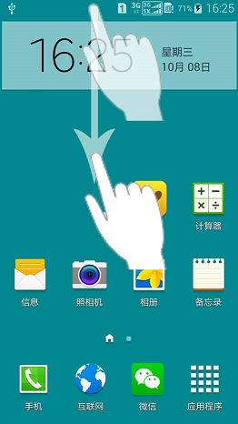
 
        2）滑动后显示的界面中，点击下图画圈处
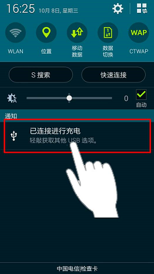
 
        3）在打开的界面中，点击“媒体设备（MTP）”，就能正常连接了。
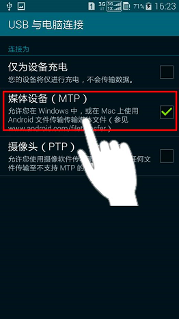

    （2）华为更改连接模式教程

         1）华为手机接入后，正常是会直接弹出连接****模式提醒弹窗，这时直接选择“媒体设备（MTP）”模式即可正常连接

 
         2） 如果你的华为设备没有自动弹出连接模式选择，就从屏幕顶端至上而下的滑动。
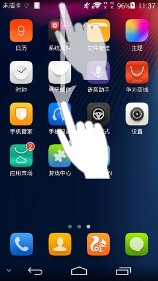
 
         3）滑动后显示的界面中，点击下图画圈处
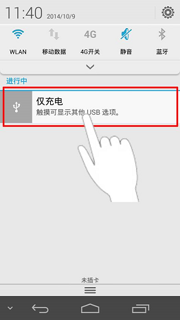
 
         4）在打开的界面中，点击“媒体设备（MTP）”，就能正常连接了。
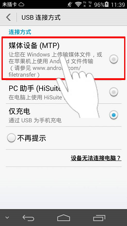

- 6.是否为USB调试模式？USB调试模式是安卓系统提供的一个用于开发工作的功能，使用该功能才能在Android设备上安装游戏软件等。不同的Andriod系统版本打开USB调试模式的方法不同，所以请根据您的Android系统版本号，我们来查看一下具体的方法。
    
    (1)Android 1.5 - Android 3.2，进入“设置” -> “应用” -> “开发” -> “USB调试”进行勾选，不同的手机由于
    ROM 不一样，可能有细微的差别。

    (2)Android 4.0.X，点击“设置” -> “开发人员选项” -> “USB调试”进行勾选。

    (3)Android 4.1.X，点击“设置” -> “开发人员选项” -> “右上角打开开发模式” -> “USB调试模式”进行勾选。

    (4)Android 4.2 - Android 4.3，点击“设置” -> “关于手机” -> “版本号（连续双击后返回主菜单）” -> “开发人员选项” -> “右上角打开开发模式” -> “USB调试模式”进行勾选。

    下面分别选择了市面上比较常见的 Android2.3版本和 Android4.2版本进行图文说明。  
    （1）Android 2.3 版本 USB 调试模式打开方法

        1）在主界面按菜单键，点击“系统设置”。见下图红圈处。
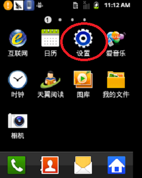

        2）点击“应用程序”。见下图红圈处。
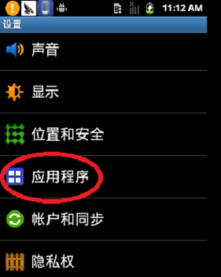

        3）点击“开发”。见下图红圈处。
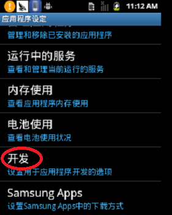

        4）勾选“USB调试”。见下图红圈处。
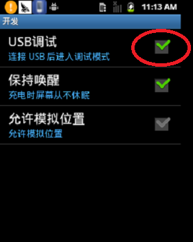

    （2）Android 4.2 版本 USB 调试模式打开方法

        1）进入“设置”页面，点击“关于平板电脑”。见下图红色方框。
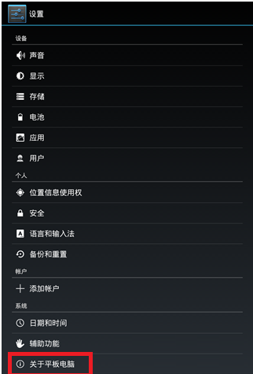

        2）疯狂点击“版本号”，见下图红色方框，直到出现“您现在处于开发者模式！”。
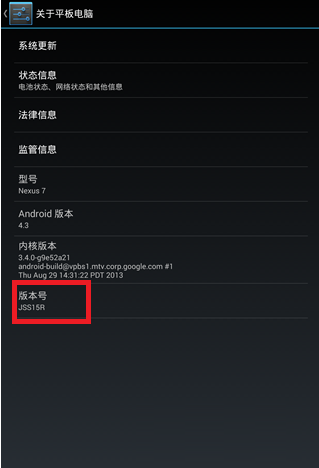

        3）出现“您现在处于开发者模式！”。见下图红色方框。
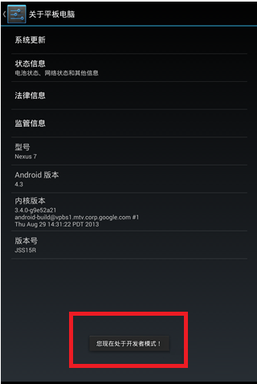

        4）退回到“设置”页面，这时在“关于平板电脑”上面多了一个“开发者选项”，点击进入。见下图红色方框
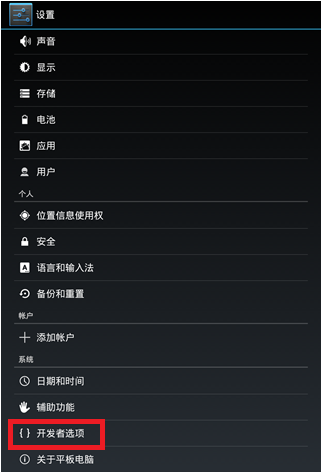

        5）勾选“USB调试”。见下图红色方框。注意：右上角的开关要保持“打开”状态
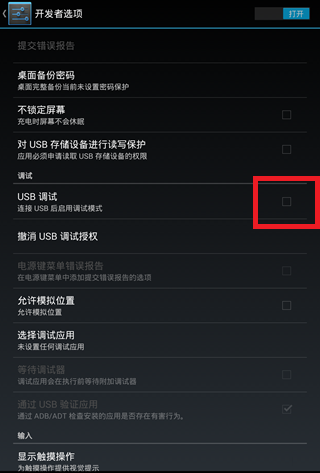

        6）点击“确定”，允许USB调试。见下图红色方框。
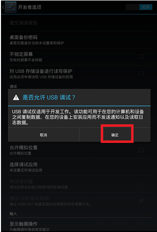

        7）当把手机插到电脑上时，点击“确定”，允许你的电脑进行USB调试。至此，你已经成功打开USB调试模式了。见下图红色方框。
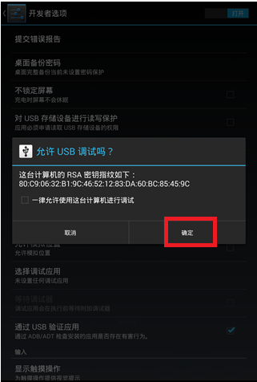

- 7.实在不行,要不重启电脑和Android设备？您的设备后台可能存在大量程序运行，导致连接超时。请重启您的设备，打开Cocos Studio,再重新尝试连接。
