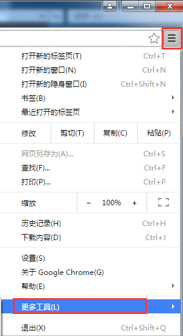
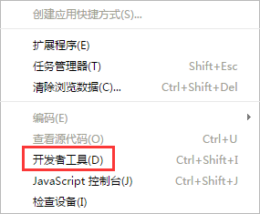
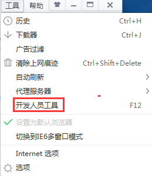
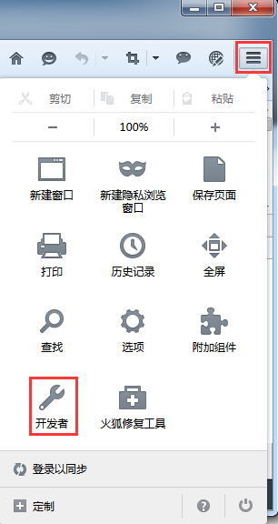
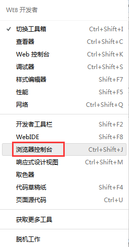
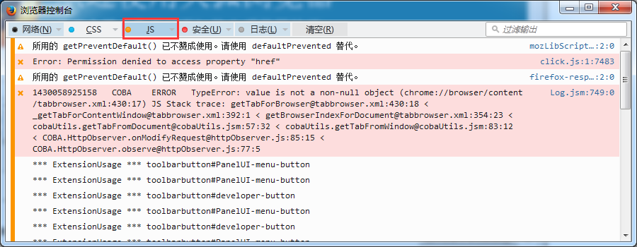

#浏览器运行效果不正确如何定位教程
如果您的项目是JS项目，点击“在浏览器运行”，浏览器运行效果不正确，大家可以参考一下两种方法进行定位。

####1，将当前浏览器加载的场景所用的资源加到：JS项目 src/resource.js里面，比如：

   原始resource.js:  

  修改后的resource.js:

   

  把当前场景的资源添加到g_resources=[...]里面。

####2，开启“开发者工具”，根据log定位问题：

   Chrome浏览器：

   设置-》更多工具-》开发者工具

   

####360安全浏览器：
  
   工具-》开发人员工具：

  

####火狐浏览器：

设置-》开发者-》浏览器控制台-》JS

 
   
 

 

