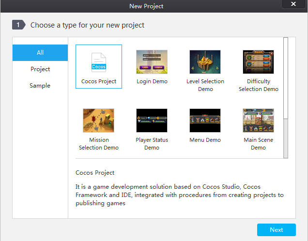
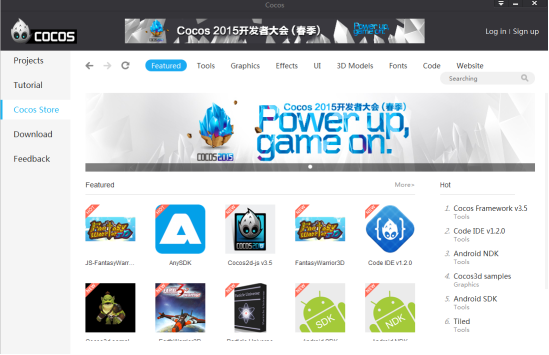
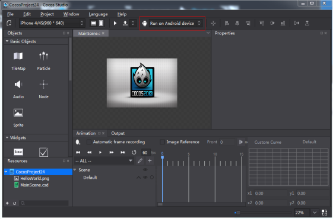
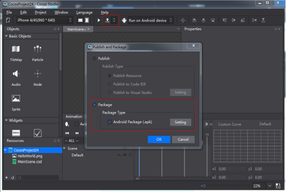
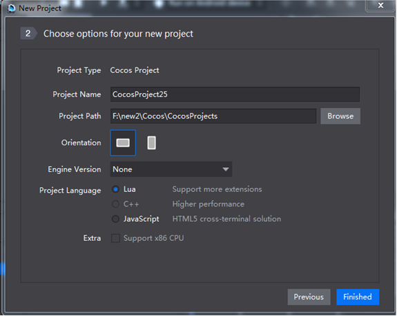
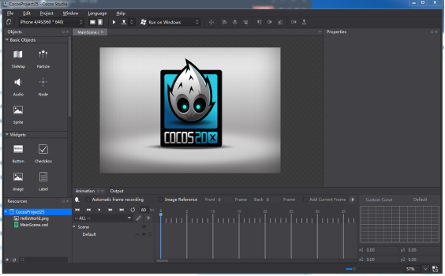

#Cocos入门教程
欢迎您使用Cocos！

Cocos是全球最受欢迎的移动游戏开发解决方案，无论您是开发新手还是行业资深人士都可以使用Cocos极大地提升游戏开发效率，降低沟通成本，实现游戏的快速迭代，Cocos专为手游而生，专为您而生！

###一,认识Cocos项目：

Cocos项目整合了资源编辑,代码编辑，真机运行以及游戏打包的功能：

资源编辑：通过Cocos可以直接进行游戏界面（UI），2D/3D场景（Scene），动画（Animation）的编辑，同时支持国内外最优秀工具产出的数据，比如：支持TexturePacker产出的plist合图数据，支持Flash产出的动画数据，支持Particle Designer以及Particle Universe产出的粒子数据，支持3DMax产出的3D模型/动画数据等等，这些优秀的工具不用再去google搜索下载，我们已经把它们添加到Cocos启动页“商店”里面，大家可以直接到商店里面免费下载使用，如下图：

代码编辑：Cocos项目支持lua，js，C++三种语言，支持Visual Studio， XCode， CodeIDE进行游戏代码编写与调试，Visual Studio，XCode分别是Windows和Mac系统上最强的代码IDE，CodeIDE是由触控开发的专门针对于lua，js两种语言的代码编写与调试工具，大家可以根据喜好选择使用。

真机运行：在游戏开发过程中，Cocos支持运行项目在android，ios手机上，windows和Mac操作系统上以及浏览器上， 如下图：

游戏打包：当游戏开发完毕之后，可以通过Cocos生成游戏App，支持android，ios，HTML5 App的生成，如下图：

###二,新建Cocos项目：

 
Cocos新建项目可以设置项目的名称，项目路径，屏幕方向，引擎的版本，项目语言以及附加功能。

项目名称，项目路径，屏幕方向没什么可说的，引擎版本要给大家介绍一下，在没有安装Cocos Framework（整合cocos2d-x以及cocos2d-js引擎源代码，并基于整合后的源代码进行编译，编译出来的二进制库就是Cocos Framework， Cocos Framework同时支持luabinding， jsbinding， js， C++， 商店里面可以下载）只可以新建js和lua的项目，C++项目需要安装Cocos Framework，当安装了Cocos Framework后，可以在引擎版本选择安装的Cocos Framework进行新建。

####项目语言包含lua, C++, JavaScript,：
  Lua：脚本语言，基于cocos2d-x luabinding（将cocos2d-x接口绑定到lua层并加入quicklua框架），可以运行在windows，mac，android，ios。

  C++：编译型语言，基于cocos2d-x引擎，可以运行在windows，mac，android，ios。

  JavaScript：脚本语言，基于cocos2d-js引擎， cocos2d-js引擎包含cocos2d-x jsbinding（将cocos2d-x的接口绑定到JS层）和cocos2d Html5（纯JS 引擎），jsbinding和Html5接口兼容，同一套JS游戏逻辑代码既可以驱动cocos2d-x也可以驱动Html5原生引擎，当打包到win32，Mac，ios，android平台的时候默认基于JSBinding，打包到HTML5基于Html5引擎。

附加功能: 只针对于android，开启“支持x86架构CPU”后，编译出来的android app可以运行在使用x86架构的CPU的手机上。

###三,点击完成。
   根据参数选择好自己想要的，点击完成，Cocos项目被创建出来了:

   学习使用Cocos制作闹钟：[http://cn.cocos2d-x.org/tutorial/show?id=2438](http://cn.cocos2d-x.org/tutorial/show?id=2438)

   学习使用Cocos打包：[http://cn.cocos2d-x.org/tutorial/show?id=2419](http://cn.cocos2d-x.org/tutorial/show?id=2419)

