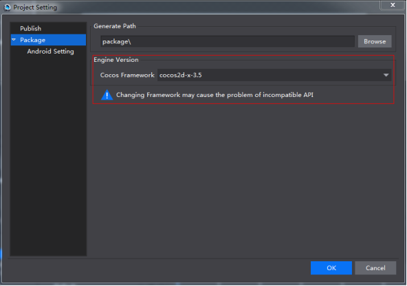

##修复升级或降级Framework后引发问题

当大家安装了多个Framework的时候，在菜单-》项目（P）->项目设置...-》打包，可以切换Framework的版本，如图：

         

设置新的Framework后，下一次打包或者运行在设备上的时候，会自动对当前项目进行升级，升级脚本只会把当前项目的proj.android, proj,ios_mac, proj.win32的项目文件中引用库的路径重定向到新的Framework库所在的目录，并不会对当前项目的文件进行合并，包括Classes下面的文件以及proj.android, proj,ios_mac, proj.win32里面除掉项目文件其他部分，所以当大家发现升级后的项目运行不起来的时候，可以采用以下方法进行解决：

新建一个基于新的Framework创建的项目，然后将这个项目与升级之后的项目进行对比，把Classes下面的文件以及proj.android, proj,ios_mac, proj.win32里面除掉项目文件其他部分进行手动合并，这样便可以解决您的问题。

