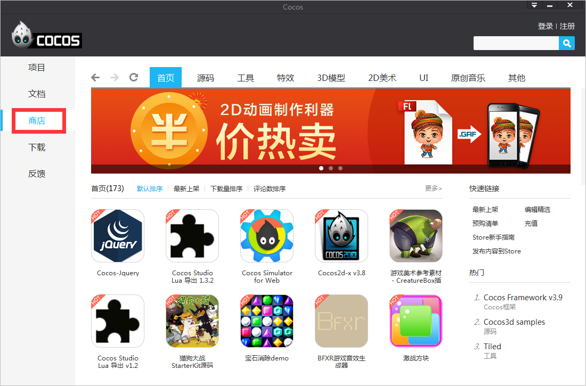
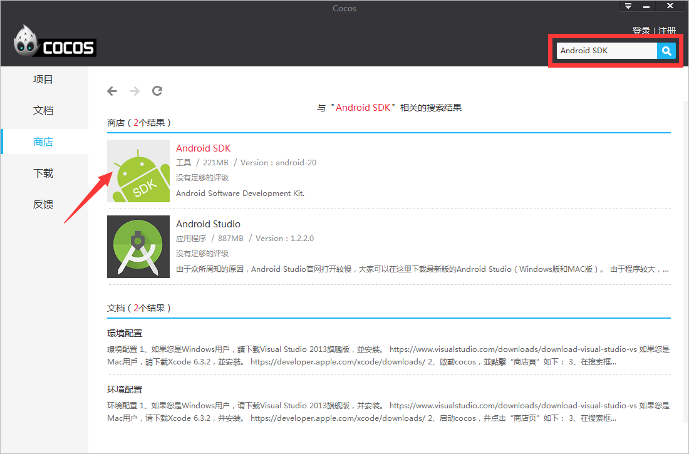
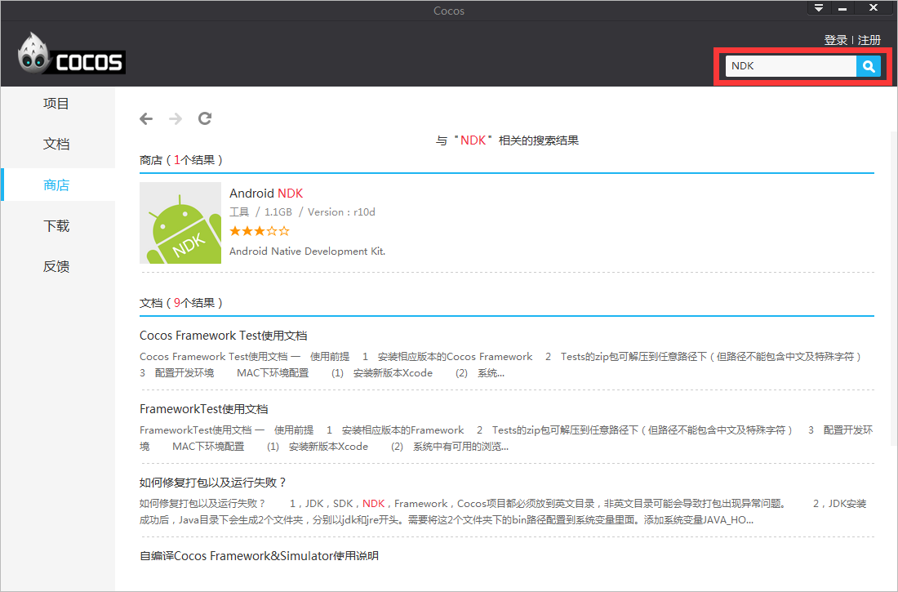
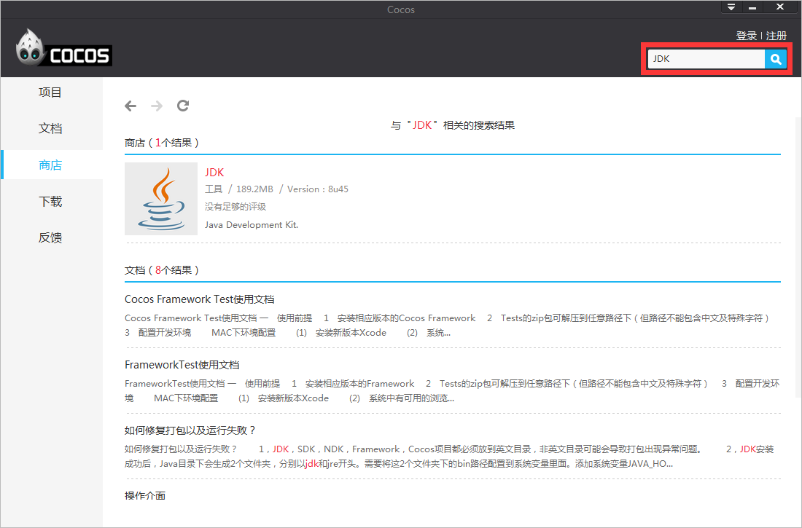

#环境配置

1, 安装IDE：

- 如果您是Windows用户，请下载**Visual Studio 2013**，并安装：

   &emsp;&emsp;[https://www.visualstudio.com/downloads/download-visual-studio-vs](https://www.visualstudio.com/downloads/download-visual-studio-vs)

- 如果您是Mac用户，请下载**Xcode最新版本**，并安装：

   &emsp;&emsp;[https://developer.apple.com/xcode/downloads/](https://developer.apple.com/xcode/downloads/)

- 请下载**Android Studio 1.4及其以上的版本**并安装：

   &emsp;&emsp;[http://developer.android.com/sdk/index.html](http://developer.android.com/sdk/index.html "http://developer.android.com/sdk/index.html")

2,启动cocos，并点击“商店页”如下： 

3,在搜索框输入“Android SDK”，回车，下载并解压，如下图：

4,在搜索框输入“NDK”，回车，下载并解压，如下图：

5,在搜索框输入“JDK”，回车，下载并安装，如下图：

