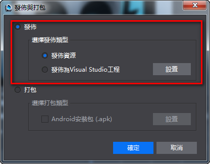

#編碼與調試

&emsp;&emsp;從Cocos Studio“發佈與打包”介面可以分別打開Visual Studio，以及Xcode，如下圖：

&emsp;&emsp;&emsp;&emsp;&emsp;&emsp;&emsp;&emsp;           

&emsp;&emsp;Visual Studio 調試幫助 [https://msdn.microsoft.com/zh-cn/library/aa290595%28v=vs.71%29.aspx](https://msdn.microsoft.com/zh-cn/library/aa290595%28v=vs.71%29.aspx)
         
    
