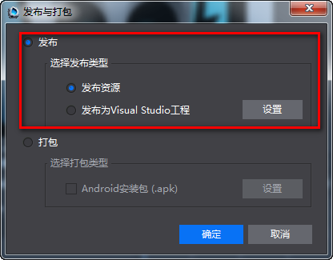

#编码与调试

&emsp;&emsp;从Cocos Studio“发布与打包”界面可以分别打开Visual Studio，以及Xcode，如下图：

&emsp;&emsp;&emsp;&emsp;&emsp;&emsp;&emsp;&emsp;           

&emsp;&emsp;Visual Studio 调试帮助 [https://msdn.microsoft.com/zh-cn/library/aa290595%28v=vs.71%29.aspx ](https://msdn.microsoft.com/zh-cn/library/aa290595%28v=vs.71%29.aspx )
    
