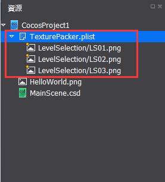
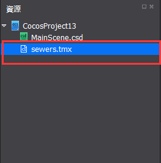
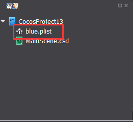
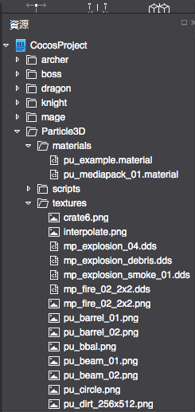

#使用外部編輯器

&emsp;&emsp;Cocos 2d-x支持的所有外部工具，Cocos Studio也全部都支援，把這些外部的工具匯出的資料，導入到資源面板，再配合上Cocos Studio現有的控制項就可以使用了，下面介紹一下幾種編輯器的使用方法。

### 1.Texture Packer

&emsp;&emsp;使用Texture Packer，匯出plist合圖為：

&emsp;&emsp;TexturePacker.plist TexturePacker.png，右鍵點擊編輯器資源面板，選擇“導入資源…”，選擇TexturePacker.plist，導入成功後如下圖：

&emsp;&emsp;
 
&emsp;&emsp;資源面板會自動展開當前plist所包含的png圖片，這樣就可以拖plist合圖裡面的檔給控制項賦值了，當發佈之後，控制項所使用的圖片就是plist合圖圖片。

### 2.Tiled

&emsp;&emsp;使用Tiled匯出地圖檔為：

&emsp;&emsp;sewers.tmx sewers.png，右鍵點擊編輯器資源面板，選擇“導入資源…”，選擇sewers.tmx，導入成功後如下圖：

&emsp;&emsp;

&emsp;&emsp;添加一個地圖控制項到渲染區，就可以給地圖控制項賦值了。

### 3.Particle Designer（僅有Mac版本）

&emsp;&emsp;使用Particle Designer，匯出plist特效粒子檔為：

&emsp;&emsp;blue.plist，右鍵點擊編輯器資源面板，選擇“導入資源…”，選擇blue.plist，導入成功後如下圖：

&emsp;&emsp;

### 4.Particle Universe

&emsp;&emsp;為了讓廣大開發者實現絢麗的3D粒子特效，我們Studio支持Particle Universe（基於OGRE的免費粒子編輯器）匯出的3D粒子特效。首先，使用者需要在Particle Universe製作好粒子的特效檔。如下圖所示的pu文件，材質,貼圖和腳本分別位於materials/texture/script資料夾中：

&emsp;&emsp;

&emsp;&emsp;1）使用者保持粒子檔的資料夾結構不變，導入到Studio中，如下圖所示：

&emsp;&emsp;
 
&emsp;&emsp;2）用戶把Script資料夾下的pu檔，拖入到場景中使用。
