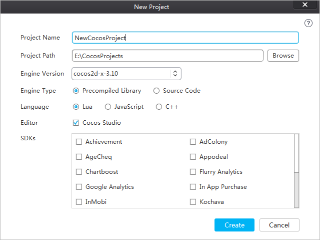
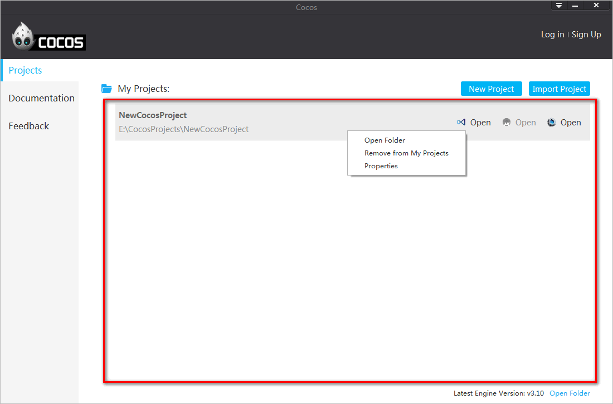
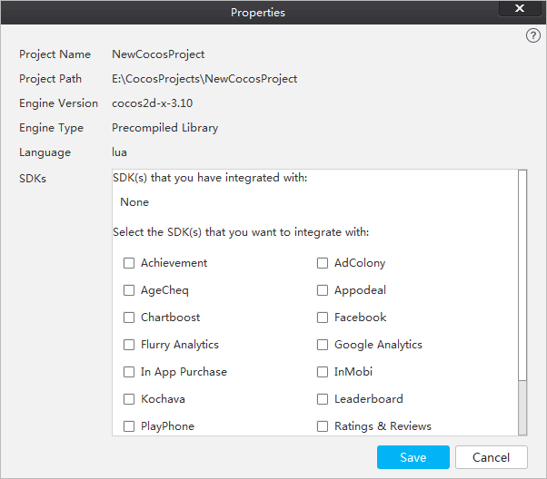
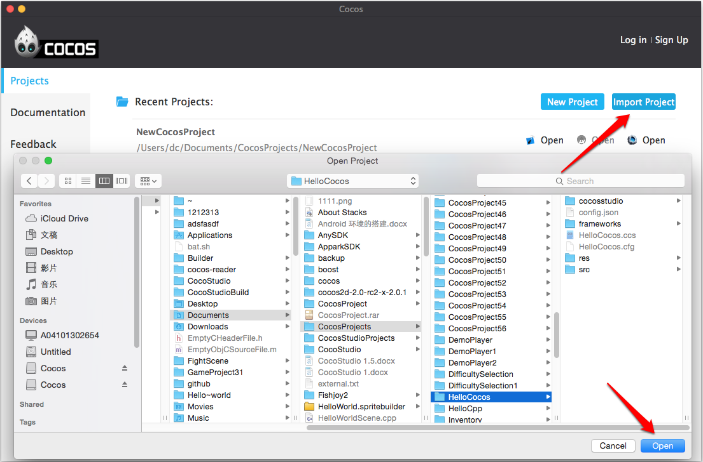
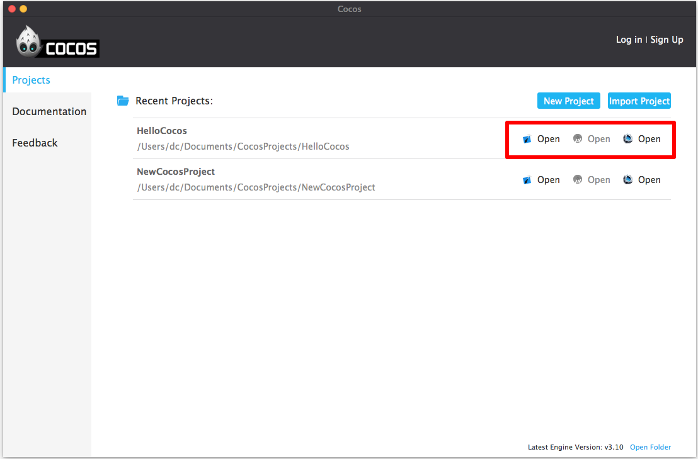
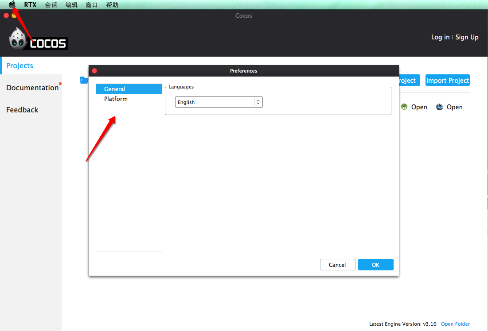
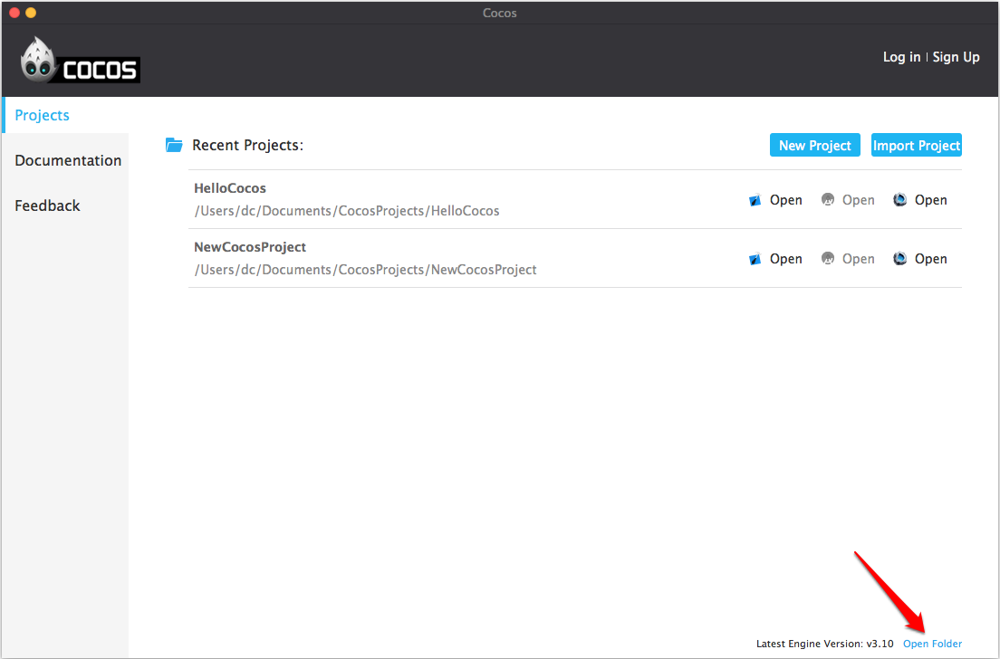
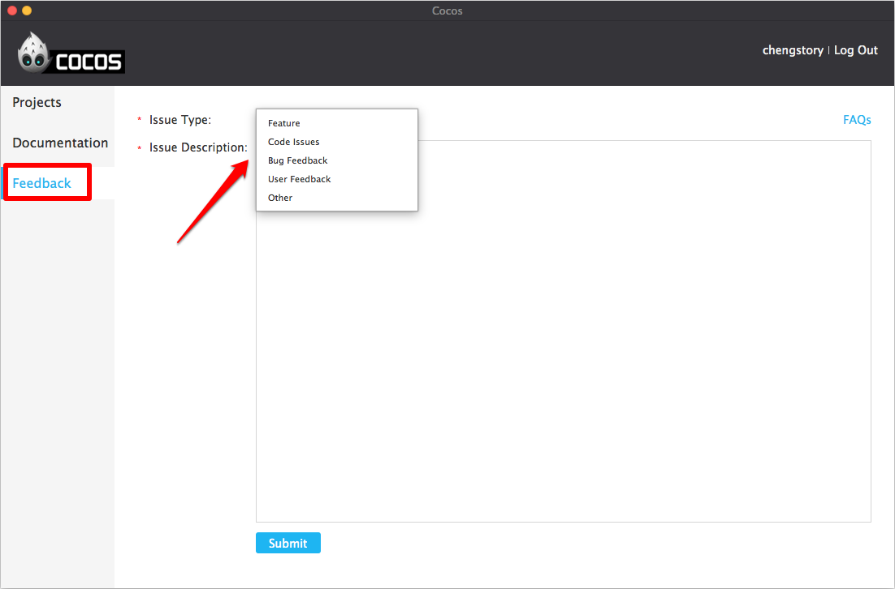

#Cocos launcher

With Cocos launcher, you can quickly create projects, import projects and integrate with SDKs. 

### 1. New Project ###

Follow the steps below to create a project. 

- Open cocos launcher
- Click **New Project**
- Specify your project settings
- Click **Create**

**Project Name**：the name of the project to be created.

**Project Path**：the folder in which your projects are located.

**Engine Version**：version of cocos2d-x you use to create projects. 

**Engine Type**：

- Precompiled Library: a static library of the cocos2d-x source code. This would speed up compile times as there is no need to continually build the engine's source.

- Source Code: cocos2d-x source code. 

**Language**：

- Lua：based on cocos2d-x Lua binding. It can run on Android, iOS, Windows Phone, Windows, Mac. 

- JavaScript：based on cocos2d-js, also includes cocos2d-x JavaScript bindings. The JavaScript bindings are compatible with HTML5. You can run code in cocos2d-x runtime and HTML5 native engine. The default settings will be JavaScript bindings if the projects are built for running on Android, iOS, Windows Phone, Windows and Mac. The default settings will be cocos2d-js if the projects are for HTML5.

- C++：based on cocos2d-x, It can run on Android, iOS, Windows Phone, Windows, Mac. 

**Editor**：whether or not to create a project of cocos, the official editor of cocos2d-x. 

**SDKs**：select SDKs to be integrated with. 

### 2. Recent Projects ###

Newly created projects are added to the **Recent Projects** list. 

right-click "Property" will open the "Edit Project" window displays the current project information as well as a secondary integrate services.

### 3. Import Project ###

You can create a project by importing one available on your computer. 

- Click **Import Project**

- Select the project to be imported 

- Click **Select Folder** on Windows, or **Open** on Mac. 
	

### 4. Open ###

Click **Open** to open the selected project in Visual Studio, Android Studio or cocos studio. As you hover the mouse over the each of the icons, you will see a tool-tip text describing its functionality.

### 5. Preferences... ###

- Click the triangle button at the top right of the screen.
- Choose **Preferences...**.
- Specify preferences for cocos launcher.

### 6. Open Folder ###

Click **Open Folder** at the right bottom of the screen to open the cocos folder, including cocos2d-x source codes . 

### 7. Other Options ###

In addition to **Projects**, you can view the **Documentation** and provide **Feedback** on the sidebar.

### Documentation ###

Click **Documentation** on the left, you will see cocos2d-x manual, cocos2d-x API and cocos studio manual. 

### Feedback ###

Click **Feedback** to send us your suggestions or report any problems. Select an appropriate issue type and edit the issue description. A member of the cocos Technical Support Team will contact you via e-mail.

*Note: Please login before trying to send feedback.* 

