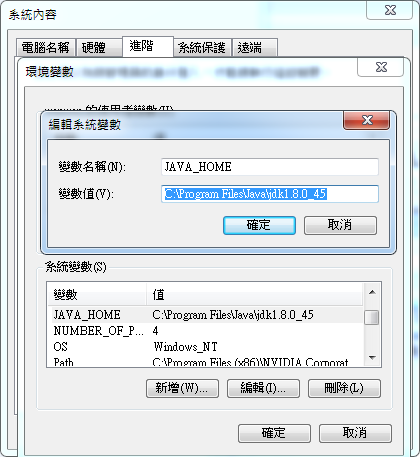
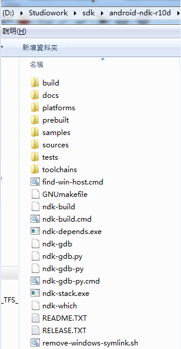
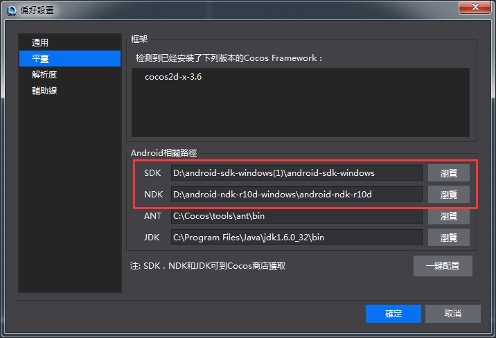
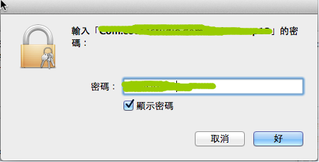
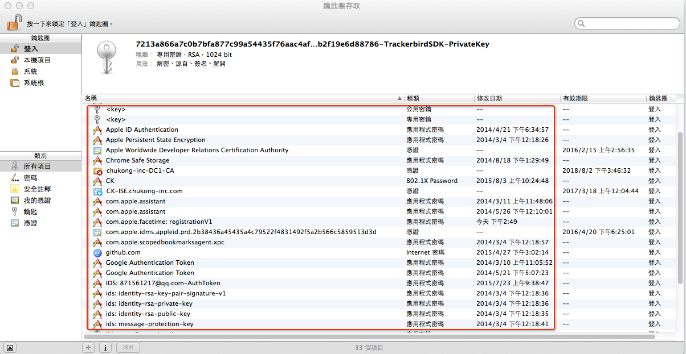
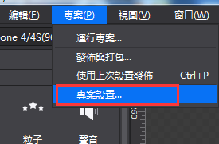
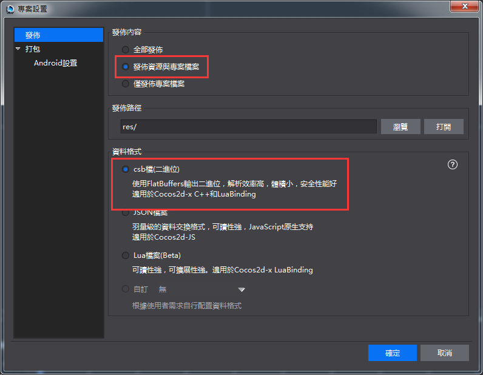
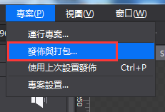
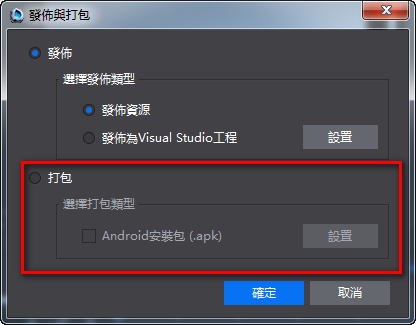
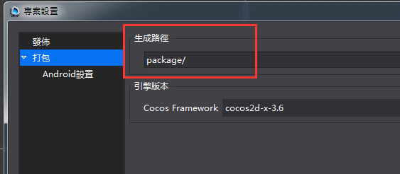

#打包與運行環境配置
&emsp;&emsp;完成以下操作，才能在編輯器中使用打包功能：

&emsp;&emsp;1,環境搭建（Win/Mac）

&emsp;&emsp;2,在編輯器中配置發佈和打包設置

###環境搭建&打包設置

&emsp;&emsp;一,Windows平臺

&emsp;&emsp;注意：JDK,NDK,SDK,Framework的安裝路徑,電腦的系統變數配置,以及編輯器打包設置中這些工具的路徑配置一定要都正確，任何一個地方不對，打包很有可能會出現錯誤。

&emsp;&emsp;1,下載JDK，安裝到英文目錄，非英文尤其中文目錄可能會導致打包出現異常問題。
安裝成功後，Java目錄下會生成2個資料夾，分別以jdk和jre開頭。需要將這2個資料夾下的bin路徑配置到系統變數裡面。

&emsp;&emsp;添加系統變數JAVA_HOME，變數值是jdk資料夾路徑。如下截圖：

&emsp;&emsp;
 
&emsp;&emsp;編輯系統變數Path，在後面追加jre資料夾下的bin路徑，注意，需要先輸入一個半形分號，再輸入bin路徑，例如： C:\Program Files\Java\jre1.8.0_45\bin，如下截圖：

&emsp;&emsp;

&emsp;&emsp;2,下載NDK，按兩下android-ndk-r10d-windows-x86_64.exe，將其安裝到英文目錄，非英文尤其中文目錄可能會導致打包出現異常問題。

&emsp;&emsp;安裝目錄下的檔截圖：

&emsp;&emsp;

&emsp;&emsp;編輯系統變數Path，在Path值後面添加android-ndk-r10d,build和platforms的路徑，以半形分號隔開，例如：
；D:\Studiowork\sdk\android-ndk-r10d\build\tools；D:\Studiowork\sdk\android-ndk-r10d；D:\Studiowork\sdk\android-ndk-r10d\platforms

&emsp;&emsp;3,下載SDK，解壓到英文目錄，非英文尤其中文目錄可能會導致打包出現異常問題。

&emsp;&emsp;編輯系統變數Path，在Path值後面添加platforms,platform-tools和tools的路徑，以半形分號隔開，例如：
；D:\Studiowork\sdk\sdk\platforms；D:\Studiowork\sdk\sdk\platform-tools；D:\Studiowork\sdk\sdk\tools

&emsp;&emsp;4,下載匹配的Framework版本，安裝到英文目錄，非英文尤其中文目錄可能會導致打包出現異常問題。

&emsp;&emsp;5,創建一個cocos項目，創建過程中一定要選擇一個Framework版本。點擊編輯器功能表列->編輯->偏好設置->平臺。

&emsp;&emsp;注意：以下路徑設置一定要正確，不然打包會出錯！

&emsp;&emsp;SDK路徑：設置為SDK資料夾路徑。（該路徑下有platforms,platform-tools和tools等資料夾）

&emsp;&emsp;NDK路徑：設置為NDK資料夾路徑。（該路徑下有build和platforms等資料夾）

&emsp;&emsp;ANT路徑：設置為Framework安裝目錄下ant的bin資料夾路徑。請注意，當電腦上安裝了多個Framework版本，打包時選了哪個版本（功能表列點擊項目->項目設置->打包->Cocos Framework版本），ant路徑最好也設置成這個Framework版本的bin資料夾路徑。

&emsp;&emsp;JDK路徑：設置為jdk的bin路徑。

&emsp;&emsp;
 
&emsp;&emsp;6,驗證環境變數和打包配置是否成功

&emsp;&emsp;點擊功能表列->項目->執行打包，打包完成後，點擊編輯器畫布下方的輸出面板，如果顯示打包成功，說明環境已經配置成功。否則需要檢查出錯的地方，重新配置。

&emsp;&emsp;7,可能引發錯誤的原因： 

- 電腦上安裝過對應工具，但版本過低。

&emsp;&emsp;解決辦法：卸載出錯的工具，清除殘留的安裝檔。去掉系統變數Path值中的該工具路徑。下載該工具，按照文檔開頭的步驟安裝,配置。

- 安裝目錄含有非英文。

&emsp;&emsp;解決辦法：參見上一條。

- 系統變數配置錯誤。

&emsp;&emsp;解決辦法：認真,仔細核對一遍所有系統變數。是否同一個工具配置了不同的路徑，是否同一個系統變數值中各個工具的路徑沒有用半形分號隔開（非常土的辦法，將變數值全選複製出來一一核對）

- Ant路徑配置錯誤。

&emsp;&emsp;解決辦法：檢查電腦上是否安裝了多個Framework版本？ant路徑是否和打包時選擇的Framework版本一致？ 

#####二,Mac平臺

&emsp;&emsp;Mac平臺工具安裝相對Windows要簡單，不需要配置環境變數。

&emsp;&emsp;1,Android打包的環境配置和Windows一樣，不同的是Mac上面需要安裝對應Mac版本的JDK,SDK,NDK。

&emsp;&emsp;2,iOS打包配置

&emsp;&emsp;重要提示：你需要有一個蘋果開發者證書（*.p12）和配對的金鑰（*.cer）

&emsp;&emsp;（1）配置蘋果開發者證書，按兩下*.p12檔，打開如下圖所示的介面，

&emsp;&emsp;

&emsp;&emsp;輸入正確的密碼，點擊“好”，打開如下圖所示的介面，

&emsp;&emsp;

&emsp;&emsp;將*.cer拖動到此介面中。

&emsp;&emsp;（2）驗證秘鑰是否添加成功。
打開終端，運行此命令：security find-identity -v -p codesigning，出現以下截圖說明添加成功了：

&emsp;&emsp;

###打包功能

&emsp;&emsp;環境搭建成功後，需要在編輯器中配置必要的發佈和打包設置，再執行打包功能。

&emsp;&emsp;**一,Windows上打包測試：**

&emsp;&emsp;1,C++項目打包舉例

&emsp;&emsp;比如：希望將一個C++項目發佈成csb格式，打apk包。

&emsp;&emsp;步驟1：設置C++項目的發佈格式，如下截圖：
 
&emsp;&emsp;

&emsp;&emsp; 

&emsp;&emsp;步驟2：執行發佈和打包，如下截圖
 
&emsp;&emsp; 

&emsp;&emsp;  

&emsp;&emsp;Apk包存放地址：

&emsp;&emsp;  

&emsp;&emsp;這是個相對路徑，在專案工程下。

&emsp;&emsp;2,Lua或JavaScript項目同理。

&emsp;&emsp;**二,Mac上打包測試：**

&emsp;&emsp;Android打包和Windows上面的一樣。

&emsp;&emsp;iOS打包：

&emsp;&emsp;1,創建一個cocos專案（必須選擇一個引擎版本）

&emsp;&emsp;2,導入專案資源

&emsp;&emsp;3,發佈專案到Xcode，修改專案的名稱和秘鑰

&emsp;&emsp;點擊左側的專案，選中“General”，修改Bundle Identifier值為*.p12檔的檔案名。本教程中使用Com.cocosstudio.demo.inhouse作為檔案名。

&emsp;&emsp; 

選中“Build Settings”->Code Signing->Code Signing Identity，選擇設置的密碼。
“Build Settings”->Code Signing->Provisioning Profile，選擇cocosstudioDemoInhouse
設置如下圖所示：

&emsp;&emsp; 

&emsp;&emsp;4,Cocos編輯器中執行打包

&emsp;&emsp;功能表列->項目->執行打包，選擇iOS或Android。

&emsp;&emsp;5,打包成功之後安裝到手機上查看效果。

###運行功能

&emsp;&emsp;運行功能的配置與打包功能的環境配置一樣，不一樣的地方在於運行支持Android手機連上PC或者Mac可以直接把遊戲推送到手機上，直接預覽效果。
