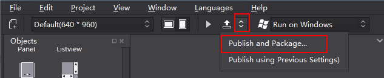
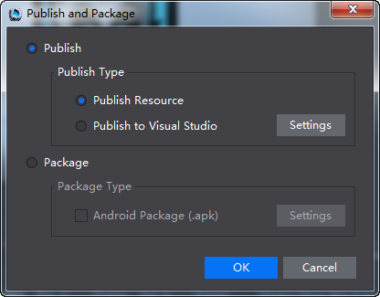
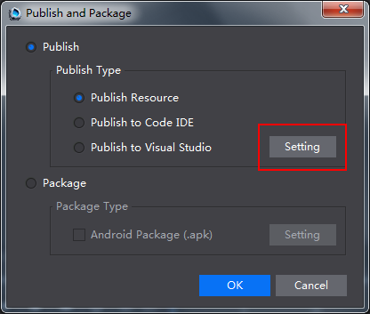
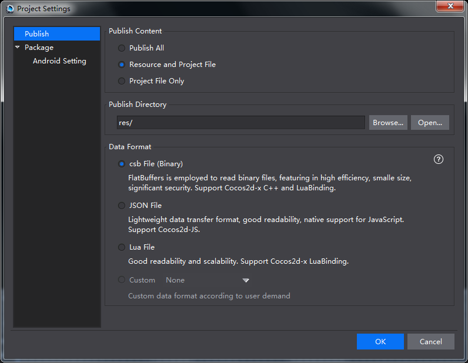

# Publish

After editing resources in Cocos Studio, you need to publish them if you want to use them in Cocos 2d-x. In Cocos Studio, project files are stored in *.xml* format. After publishing, some unnecessary data will be removed from the project file. 
and at the same time*.xml* file is transferred into FlatBuffers and JSON, which are faster and memory efficient. 

To publish resources, do the following: 

1 Open HelloCcocos, click the publish button  , and the resources are published. 

2 Click **Publish and Package**, a dialog box will pop up. 

3 Publish resources

- Publish to Visual Studio Project: only for Windows, first publish resources, then open project with Visual Studio. 

- Publish to Xcode Project: only for Mac, first publish resources, and then open project with Xcode. 

4 Select a Publish Type, and then click **Setting**, you can see the following window for project settings.  

 
5 Publish

- Resource and Project File: copy resources to publish directory; publish *csd* and *csi* for Cocos 2d-x.  

    ***Note** The transfer speed is low when publishing a number of resources. It is recommended to select "Project File Only".* 

- Project File Only: only publish csd and csi for Cocos 2d-x. 

- Publish Directory: users can customize publish directory. Cocos Studio supports absolute and relative path. 

- Data Format

    - *csb* File: FlatBuffers is employed to read binary files, featuring in high efficiency, small size and significant security. Support Cocos2d-x C++ and Lua Binding. 

    - JSON File: Lightweight data transfer format, good readability, native support for JavaScript. Support Cocos2d-JS. 
   
    - Lua File：Good readability，support Lua Binding。
   
    - Custom export: Click [Customizing Exported Data Formats](../../chapter3/Extend/CustomExport/en.md) for more information. 

