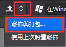
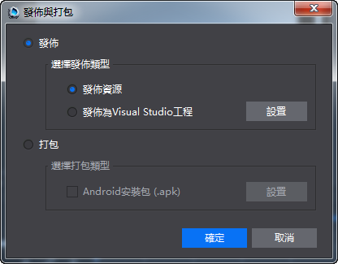
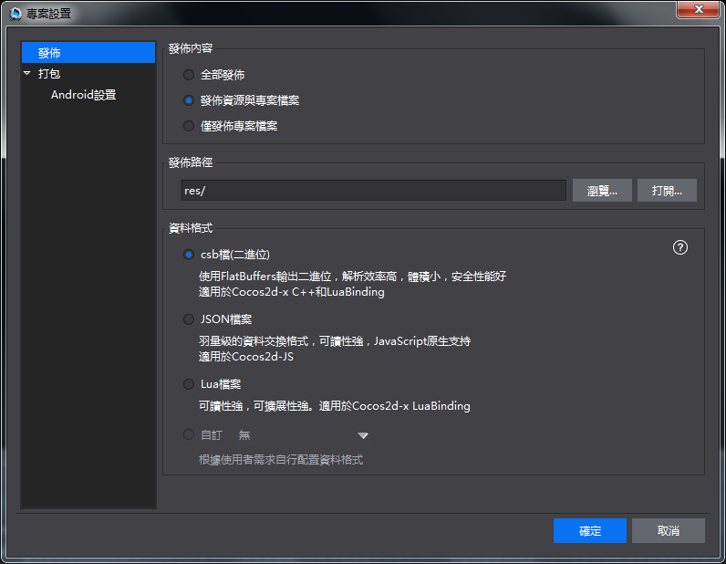

#匯出數據

&emsp;&emsp;當使用Cocos Studio編輯好資源後，我們想在引擎裡面使用，還需要發佈。因為在Cocos Studio專案檔案使用xml資料格式來進行存儲，同時會保存一些僅編輯器需要的額外資料，如果使用者使用Cocos2d-x和Cocos2d-js直接載入專案檔案，會發現專案檔案不僅大而且載入速度慢，所以我們需要一個發佈，在發佈過程中編輯器會去掉專案檔案中一些多餘的資訊，同時把xml格式轉換為flatbuffers和json格式，這兩種格式在C++,lua和JS語言中使用是容量最小，速度最快，接下來給大家講解如何發佈資源：

&emsp;&emsp;1）打開我們的HelloCocos，選擇發佈按鈕“ ”，點擊發佈，資源就發佈出去了。

&emsp;&emsp;2）點擊“發佈與打包。。。”，會彈出發佈與打包介面，如下圖：

&emsp;&emsp;&emsp;&emsp;&emsp;&emsp;&emsp;&emsp;

&emsp;&emsp;3）發佈資源：執行發佈資源過程。

&emsp;&emsp;&emsp;&emsp;&emsp;發佈為Visual Studio工程：僅Windows上，先執行發佈資源過程，然後使用Visual Studio打開專案。

&emsp;&emsp;&emsp;&emsp;&emsp;發佈為Xcode工程：僅Mac上，先執行發佈資源過程，然後使用Xcode打開專案。

&emsp;&emsp;4）點擊設置，彈出“菜單：專案->專案設置。。。”介面，如下圖：

 
&emsp;&emsp;5）發佈內容：

&emsp;&emsp;1,發佈資源與專案檔案：把編輯所用的資源拷貝到發佈路徑以及把csd，csi檔發佈為Cocos2d-x所使用的資源。注意：當資源較多的時候，拷貝速度比較慢，建議使用僅發佈專案檔案。

&emsp;&emsp;2,僅發佈專案檔案：僅把csd，csi檔發佈為Cocos 2d-x所使用的資源。

&emsp;&emsp;發佈路徑：可以自訂資源的發佈路徑，支援絕對與相對路徑。
資料格式：

&emsp;&emsp;1,csb：使用Flatbuffers輸出二進位，解析效率高，體積小，安全性能好，適用於c++與lua專案。

&emsp;&emsp;2,Json：羽量級的資料交換格式，可讀性強，JavaScript原生支持，適用於js專案。

&emsp;&emsp;3,Lua：可讀性強，適用於Cocos2d-x Luabinding專案。

&emsp;&emsp;4,自訂：參考 [匯出資料擴展。](../../chapter3/Extend/CustomExport/tw.md)

