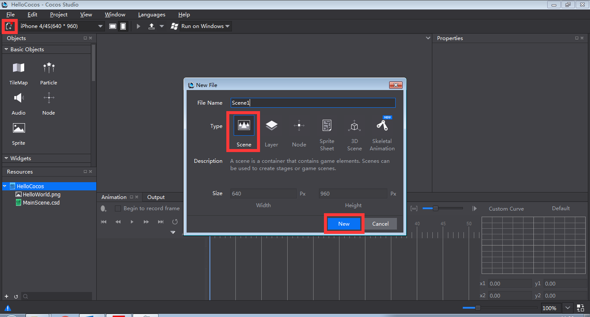
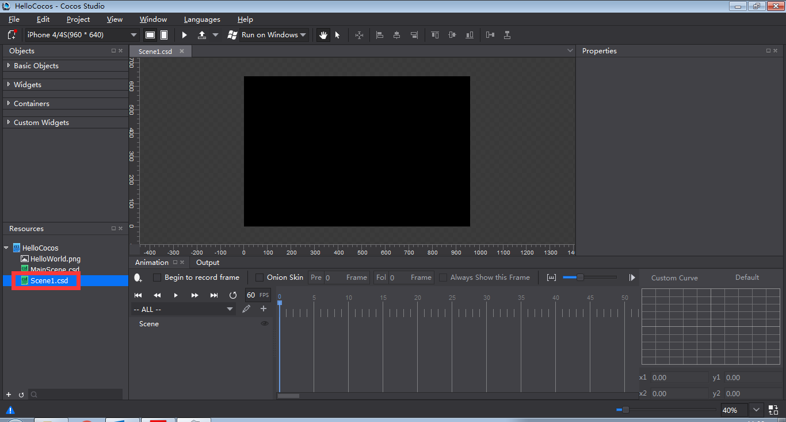
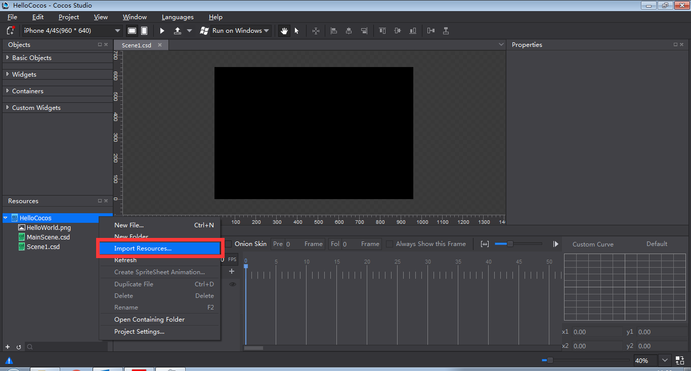
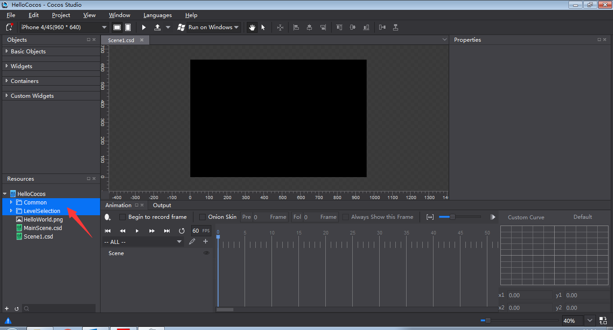
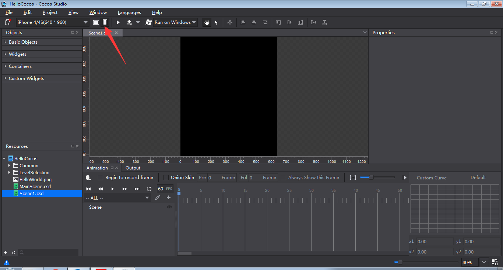
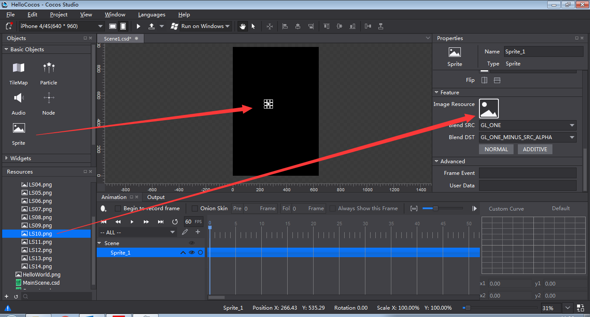
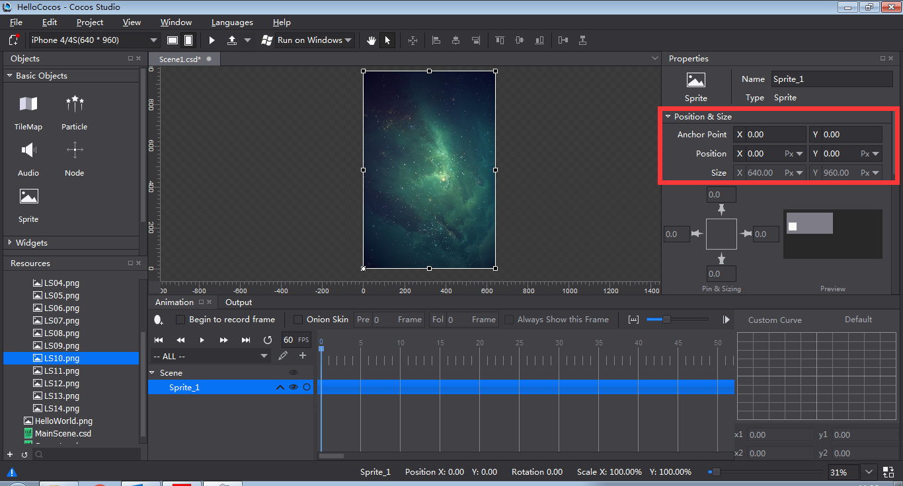
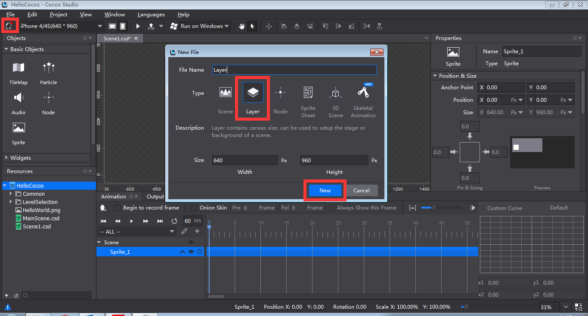
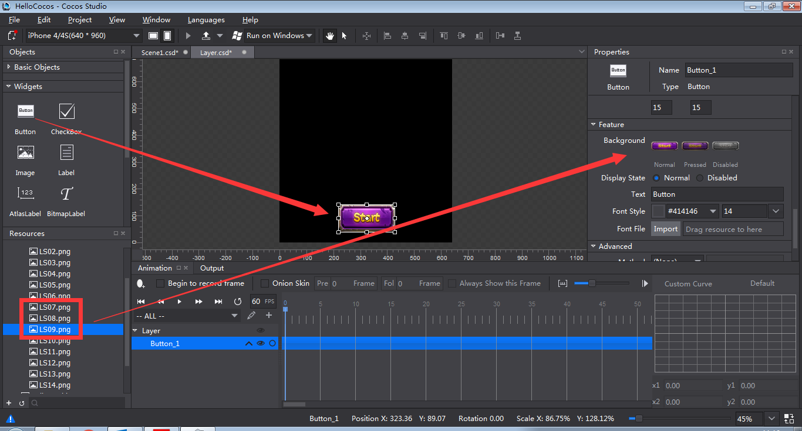
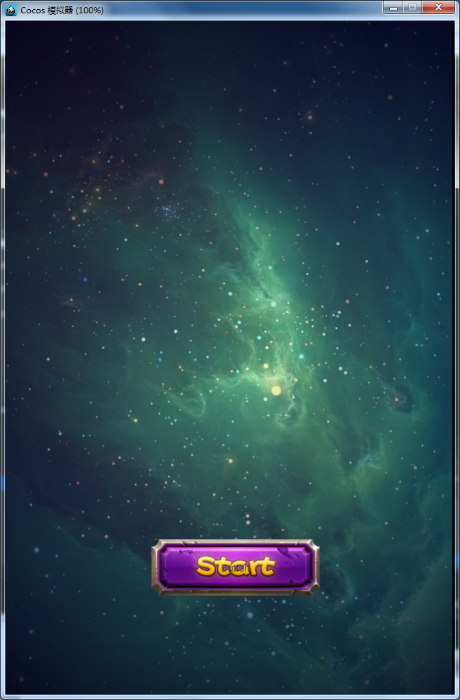

# Scenes and UI #

### Create a Scene ###

1 Create a project and name it **HelloCocos**. Do the following:

- Select **File** -> **New Project** -> **Cocos Project**, and click **Next**.

- Name the project HelloCocos, and click **Finish**.

2 Create a scene and name it **Scene1**. Do the following:

- Click **New File** button -> select **Scene** ->  name the  file **Scene1** -> click **New**.

3 Right click on **Resources** panel, select **Import Resources**, and then select files to import.

4 Import two resource folders: Common and LevelSelection.

5 Click **Vertical Screen**  to modify the screen resolution from the default setting 960 * 640* to 640 * 960.

6 Drag and drop a Sprite from **Basic Objects** to **Canvas**; drag and drop LS10.png from **Resources** panel to **Image Resource** and modify its position as tile (640 * 960).

In Cocos Studio, the procedures of creating Scenes, UI and animations are similar.

### Create a Layer ###

1 Click **New File** button and select **Layer**. Name it "Layer" and click **New**.

2 Drag and drop a Button to Canvas and specify its properties. Put it at center bottom of Canvas.

3 Add "Layer.csd" to "Scene1.csd". Do the following:

- Double click "Scene1.csd" in Resources panel to open it.

- Drag and drop "Layer.csd" to the rendering section (The layer can be accessed from the Resources section).

4 Click "Preview" button   at the top of the workspace to check the visual effects of the layer.

