#製作場景與UI：
&emsp;&emsp;[1,認識cocos編輯器主介面。](../../chapter3/Editor/UIOverview/tw.md)

&emsp;&emsp;2,製作新場景：

&emsp;&emsp;1）打開我們新建的HelloCocos項目，新建場景名稱為“Scene1”，如下圖：           
 
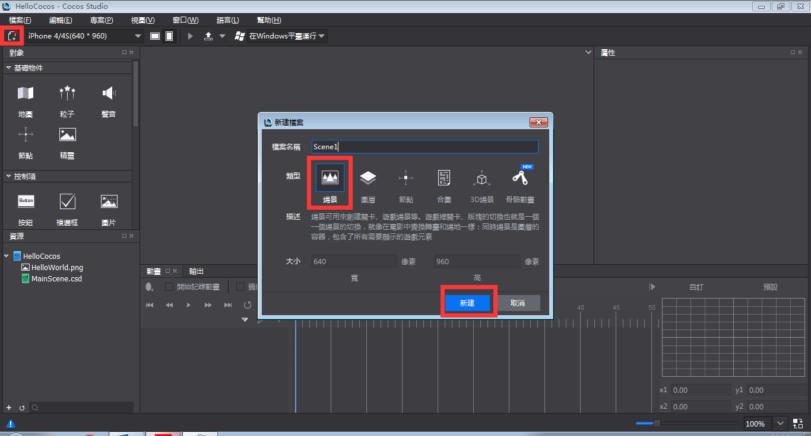

&emsp;&emsp;2）點擊新建，場景就被創建出來了，如下圖：

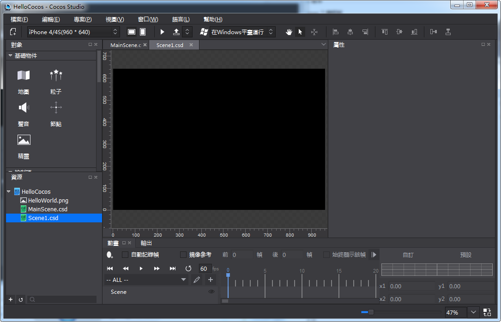
 
&emsp;&emsp;3）右鍵“資源面板”，選擇“導入資源。。”，選擇要導入的資源，如下圖：
  
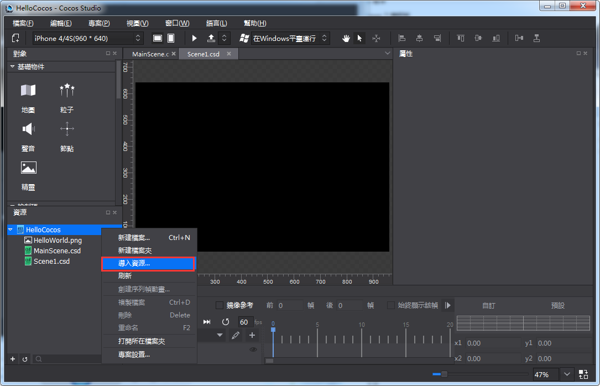

&emsp;&emsp;4）導入了Common,LevelSelecttion資源檔夾，如下圖：

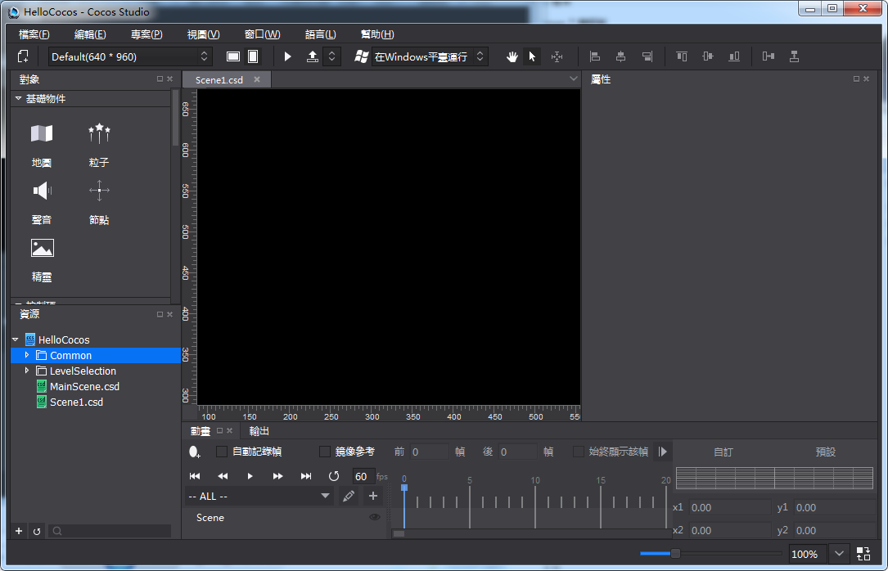
 
&emsp;&emsp;5）做一個設計解析度為 640 * 960的場景，現在默認是 960*640，點擊切換解析度切換按鈕“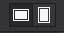”，改變效果如下圖：

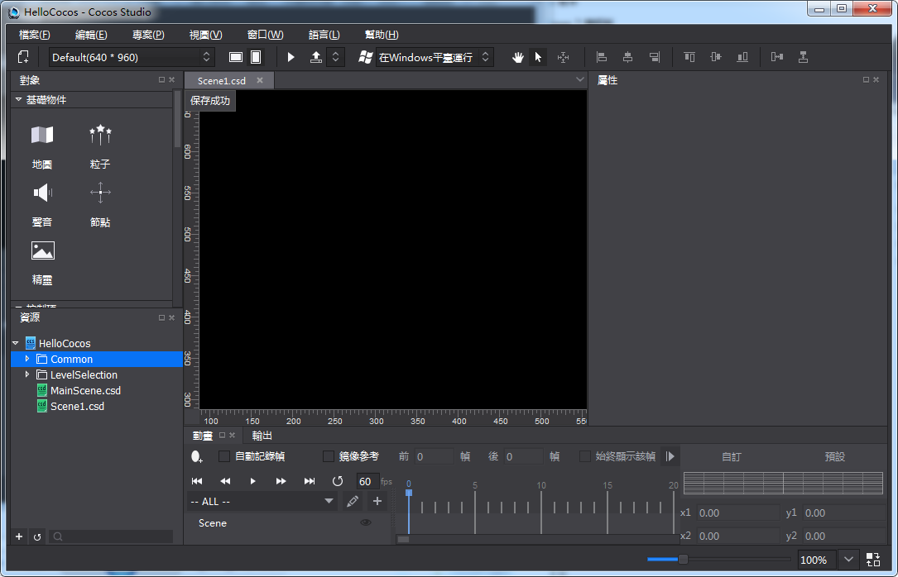

&emsp;&emsp;6）從物件面板的“基礎物件”欄，先左鍵按住拖精靈控制項到畫布面板，然後從資源區拖LS10.png給精靈控制項，圖片資源賦值，並改變座標，從而鋪滿640*960，如下圖：

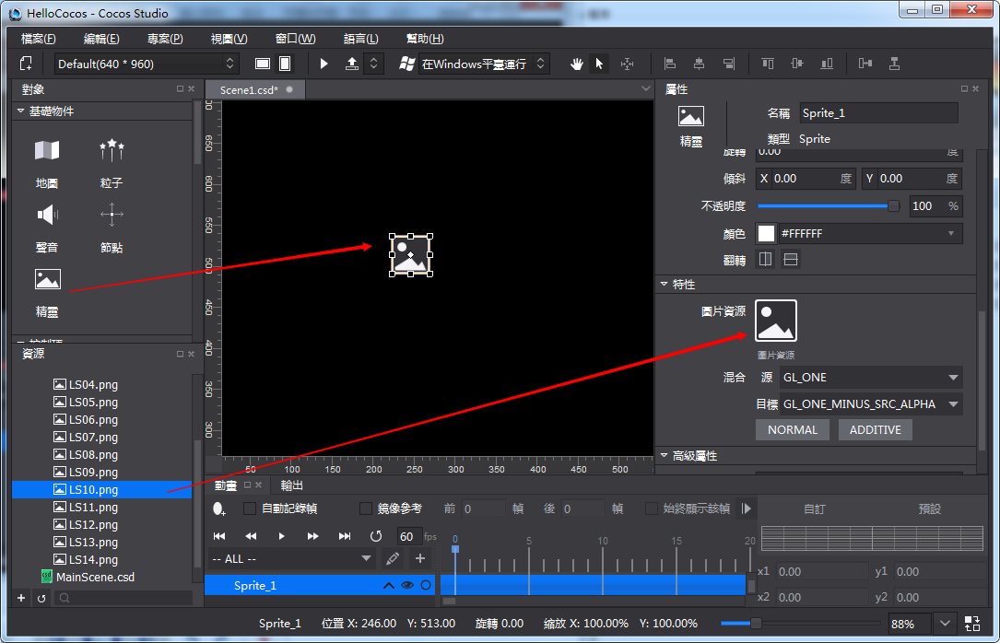

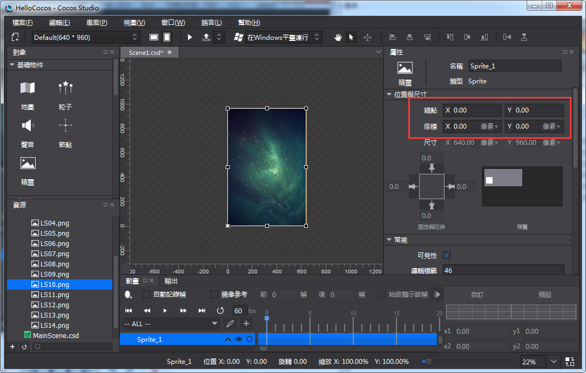
 
&emsp;&emsp;Cocos Studio拼接場景,UI,動畫都是延續這個思路，先導入資源，然後創建控制項，再給控制項賦資源，改變控制項的屬性，達到效果，這一點要記清楚。

&emsp;&emsp;3,製作新UI：

&emsp;&emsp;1）新建圖層，命名為“Layer”，如下圖：

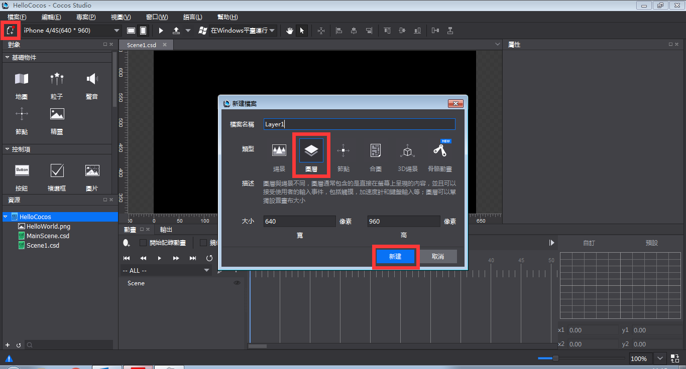
 
&emsp;&emsp;2）拖一個Button到畫布面板，然後給Button賦值，並把它放到靠底部的中間位置，如下圖：
 
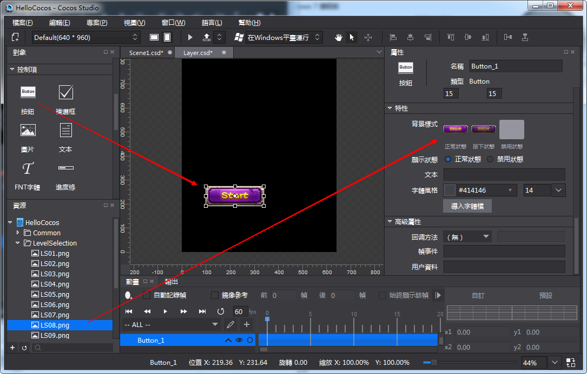

&emsp;&emsp;3）這個基本的UI介面就做好了，我們現在把這個介面放到場景裡面，在資源面板按兩下”Scene1.csd”，打開Scene1.csd後，拖動Layer.csd到渲染區，Layer.csd就被添加到Scene1.csd裡面了，這樣就完成了UI介面與場景檔的結合，如下圖：

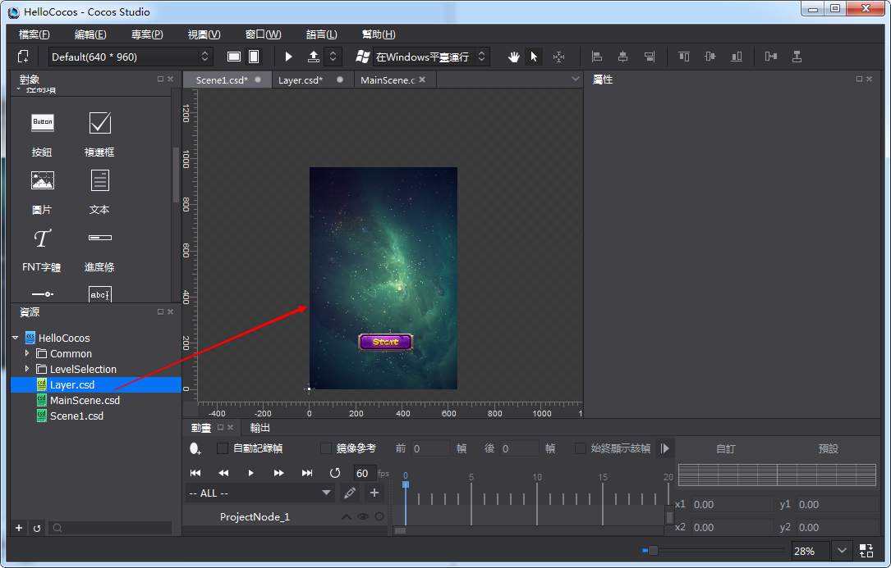

&emsp;&emsp;4）點擊工具列”預覽”按鈕，看一下場景在遊戲裡面的樣子，如下圖：
 

         

      
        
        
