#制作场景与UI：
&emsp;&emsp;[1,认识cocos编辑器主界面。](../../chapter3/Editor/UIOverview/zh.md)

&emsp;&emsp;2,制作新场景：

&emsp;&emsp;1）打开我们新建的HelloCocos项目，新建场景名称为“Scene”，如下图：           
 
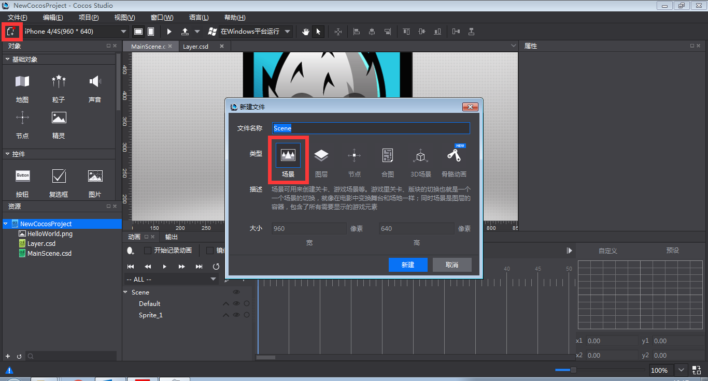

&emsp;&emsp;2）点击新建，场景就被创建出来了，如下图：

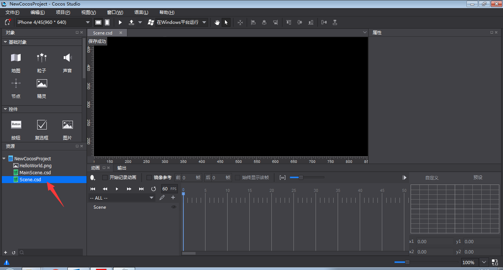
 
&emsp;&emsp;3）右键“资源面板”，选择“导入资源。。”，选择要导入的资源，如下图：
  
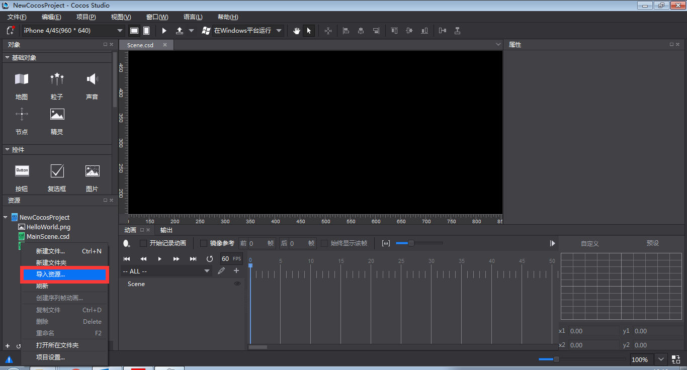

&emsp;&emsp;4）导入了Common,LevelSelecttion资源文件夹，如下图：

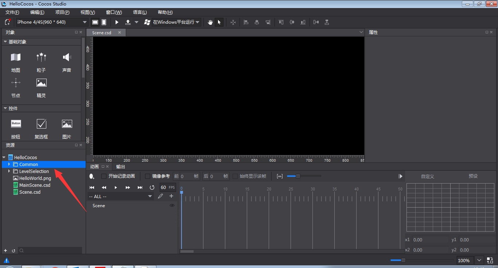
 
&emsp;&emsp;5）做一个设计分辨率为 640 * 960的场景，现在默认是 960*640，点击切换分辨率切换按钮“”，改变效果如下图：

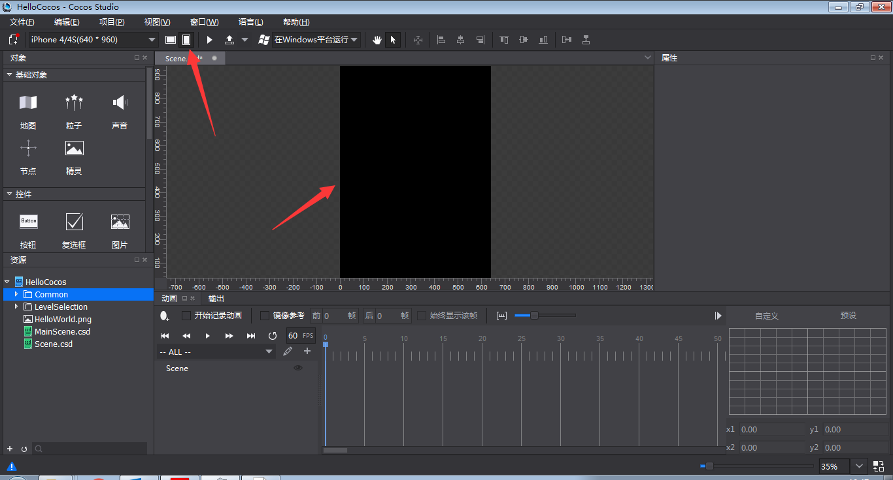

&emsp;&emsp;6）从对象面板的“基础对象”栏，先左键按住拖精灵控件到画布面板，然后从资源区拖LS10.png给精灵控件，图片资源赋值，并改变坐标，从而铺满640*960，如下图：

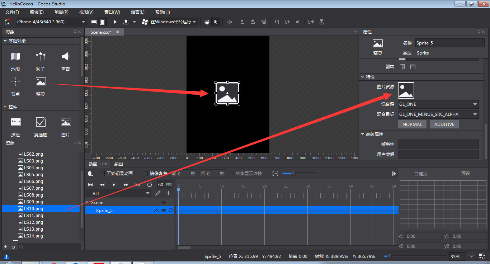

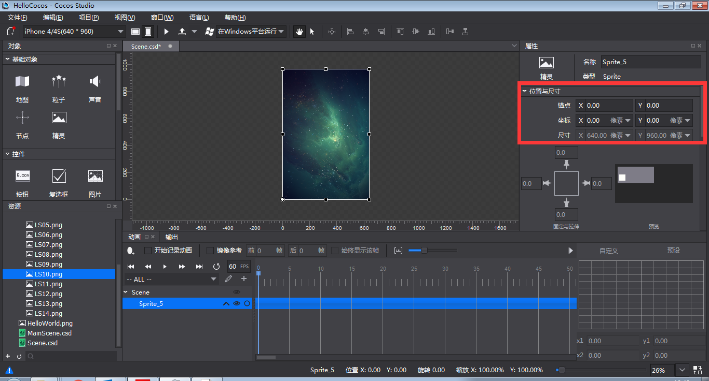
 
&emsp;&emsp;Cocos Studio拼接场景,UI,动画都是延续这个思路，先导入资源，然后创建控件，再给控件赋资源，改变控件的属性，达到效果，这一点要记清楚。

&emsp;&emsp;3,制作新UI：

&emsp;&emsp;1）新建图层，命名为“Layer”，如下图：

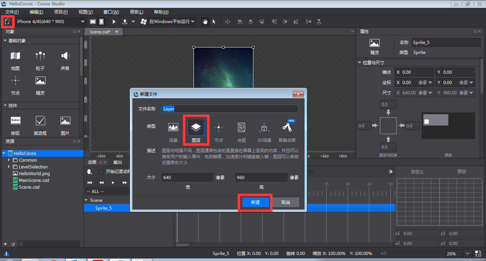
 
&emsp;&emsp;2）拖一个Button到画布面板，然后给Button赋值，并把它放到靠底部的中间位置，如下图：
 
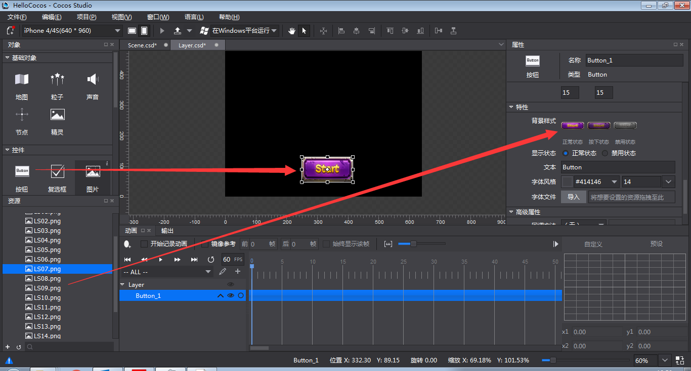

&emsp;&emsp;3）这个基本的UI界面就做好了，我们现在把这个界面放到场景里面，在资源面板双击”Scene.csd”，打开Scene.csd后，拖动Layer.csd到渲染区，Layer.csd就被添加到Scene.csd里面了，这样就完成了UI界面与场景文件的结合，如下图：

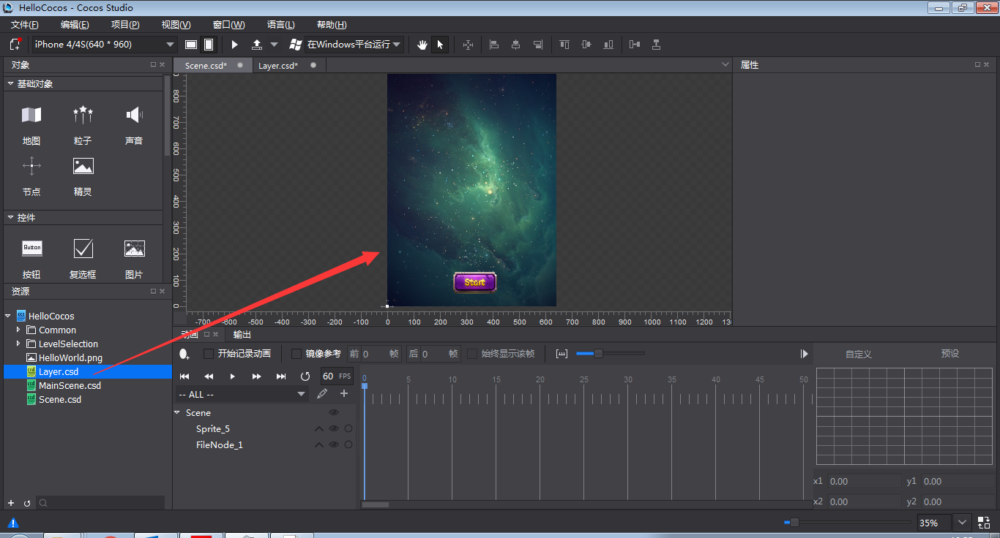

&emsp;&emsp;4）点击工具栏”预览”按钮，看一下场景在游戏里面的样子，如下图：
 
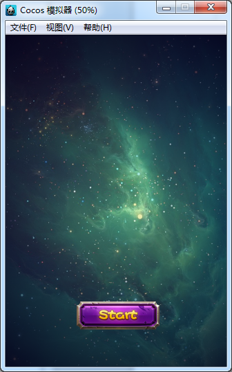

         

      
        
        
