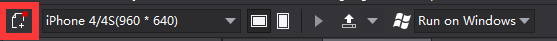
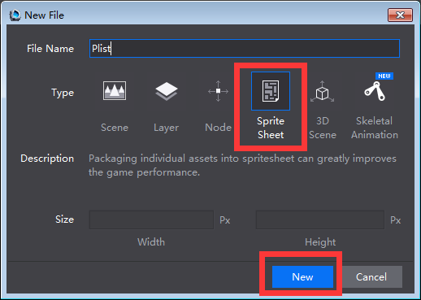
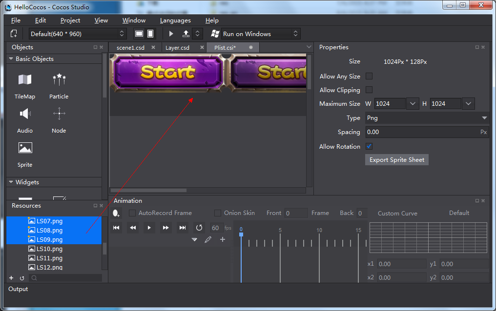
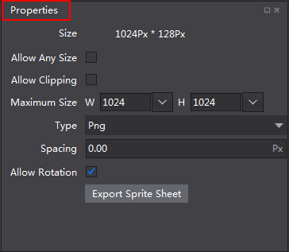

#SpriteSheet 

### Create a SpriteSheet

To create a SpriteSheet, do the following, 

1 On the toolbar, click **New File** button.
 
 

2 Select **SpriteSheet** on the pop up window,   and then click **New**.  

 

3 Select an image from project manager, drag it to the canvas. Currently Cocos Studio only supports *.png* and *.jpg* file types.

 

### Specify SpriteSheet Properties ###

 
 
**Size**: The size of the current SpriteSheet. Size property  varies with other properties.  

**Allow Any Size**: If checked, this option will ignore the power of 2 size limit, SpriteSheet can be any image size. 

**Allow Clipping**: When checked, the editor will automatically trim SpriteSheet to ensure its size minimized.

**Maximum size**: The maximum size that cocos will allow for SpriteSheet. If the file size exceeds the limit, the sections that exceed will be excluded from the SpriteSheet. 

**Type**: File type of SpriteSheet, supporting *.png* and *.jpg* format images.

**Spacing**: The gap between resources. Spacing can prevent resources from overlapping. 

**Allow Rotation**: When checked,  resources will automatically rotate to the best angle  for a SpriteSheet. 

**Export SpriteSheet**:  Export *.plist* and *.png* files for SpriteSheets. 

