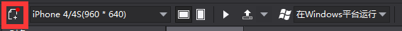
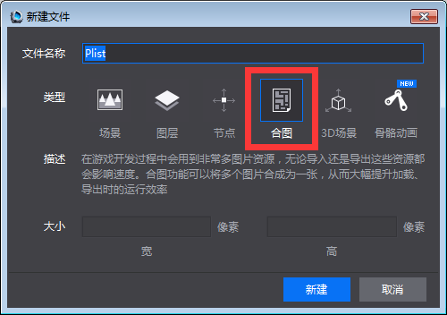
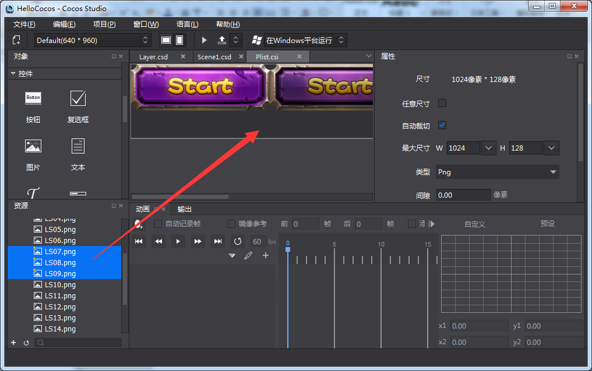
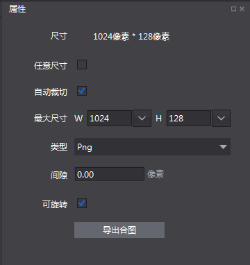

#制作合图

1,新建合图

&emsp;&emsp;新建合图文件可以通过三种方式：

&emsp;&emsp;1）在工具栏点击新建文件图标
 
 

&emsp;&emsp;2）在弹出新建文件窗口后，选择“合图”，点击新建按钮；
 

 

&emsp;&emsp;3）在资源面板取图片资源，拖拽至画布面板。目前仅图片类型（.png和.jpg）资源。如下图：

 

&emsp;&emsp;4）可通过属性面板修改合图类型文件的属性，如下图：

 
 
&emsp;&emsp;尺寸：当前合图的尺寸，该属性随其他属性改变而改变。

&emsp;&emsp;任意尺寸：勾选后合图的尺寸会根据素材的实际占用尺寸为准，不勾选的话，尺寸仅支持2的N次幂的尺寸。

&emsp;&emsp;自动裁切：勾选后，会自动将合图的边缘进行裁切，保证合图尺寸最小化.

&emsp;&emsp;最大尺寸：合图允许的最大尺寸，如果素材过多，超过了合图的最大尺寸，那么多余的素材将会被排除在合图内。

&emsp;&emsp;类型：生成合图文件的图片类型，目前支持png,jpg类型。

&emsp;&emsp;间隙：素材和素材之间的间隙，该属性可以避免素材重叠。

&emsp;&emsp;可旋转：勾选后，素材会根据算法要求，自动旋转至最佳角度参与合图。

&emsp;&emsp;导出合图：可以导出已经编辑好的合图，输出plist和png。

