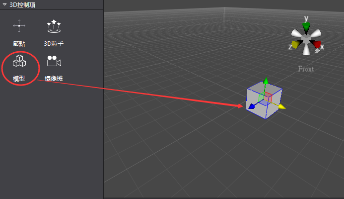
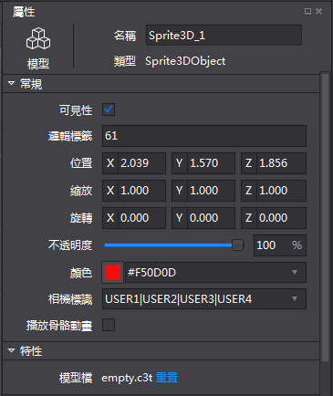
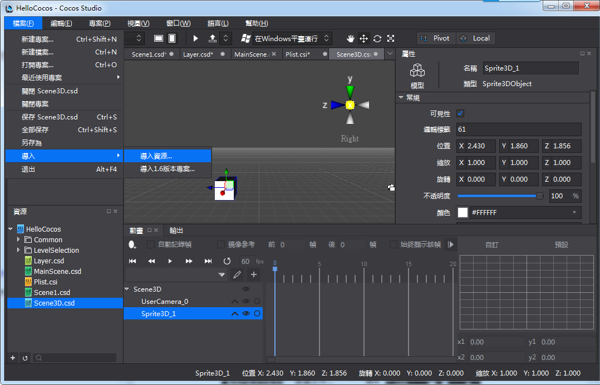
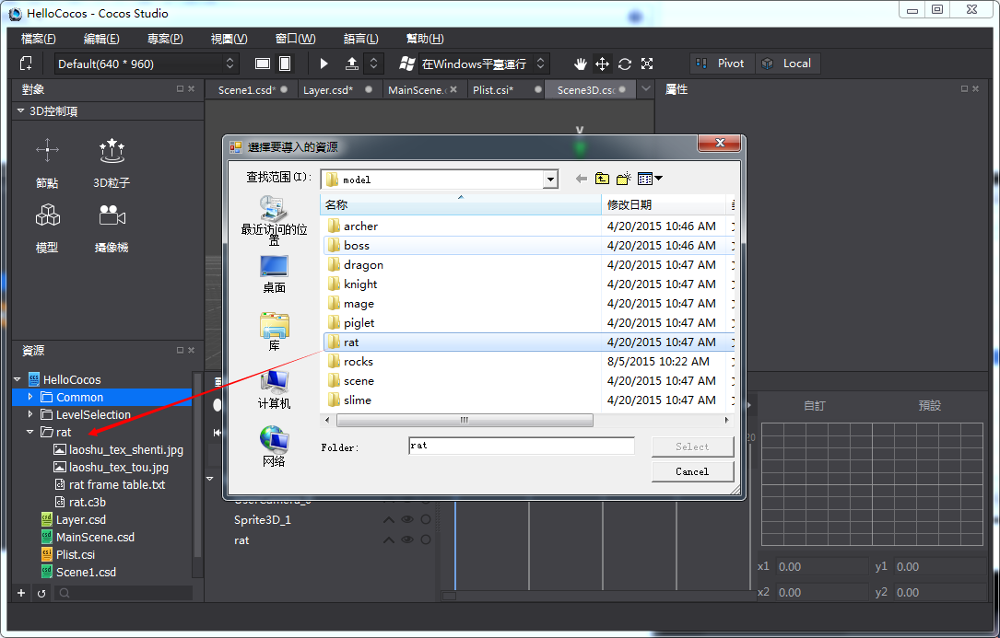
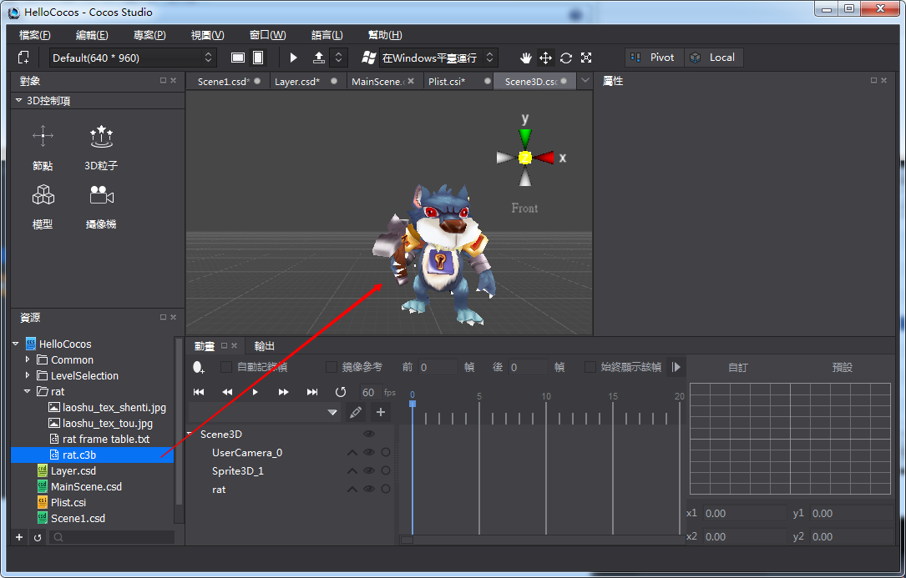

#3D模型控制項簡介

代表3D場景中一個三維物體的控制項，也就是代表了三維世界中的一個三維物體。通過設置3D模型控制項的屬性和模型貼圖來演繹出各種各樣的三維物體。

3D模型控制項使用方法

1,創建基本3D物件

&emsp;滑鼠拖拽3D控制項欄的模型控制項，拖入到場景中。

 
2,調整物件屬性

&emsp;調整基本屬性值，或者通過在場景中進行自由變換操作

&emsp;&emsp;

 
3,導入模型並使用

&emsp;把模型,貼圖檔導入到工程，然後把模型檔拖到場景使用導入三維資源圖示如下：
 
&emsp;&emsp;&emsp;&emsp;&emsp;&emsp;&emsp;&emsp;&emsp;&emsp;,

&emsp;&emsp;&emsp;&emsp;&emsp;&emsp;&emsp;&emsp;&emsp;&emsp;&emsp;&emsp;&emsp;&emsp;&emsp;&emsp;&emsp;&emsp;&emsp;&emsp;&emsp;&emsp;&emsp;&emsp;

 
&emsp;使用模型資源時，直接拖動模型檔到場景就可以使用了，圖示如下：

 
