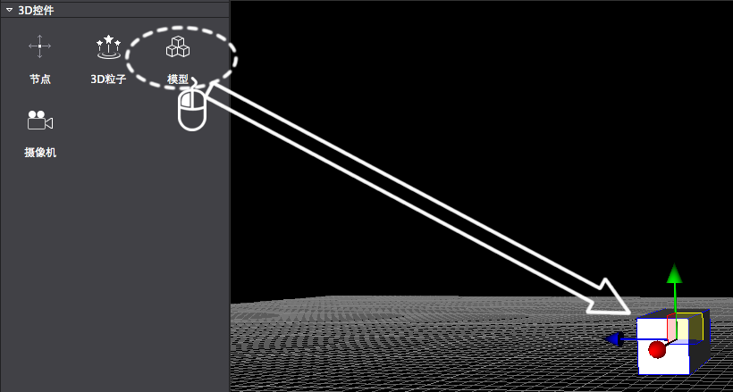
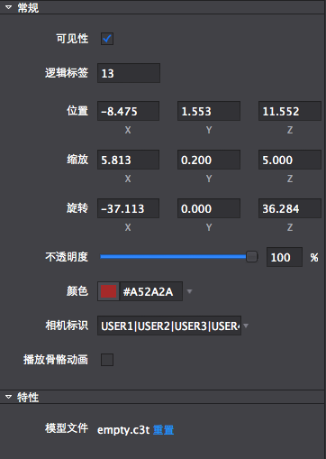
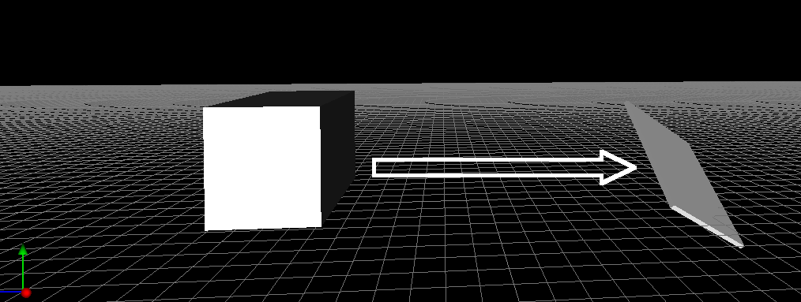
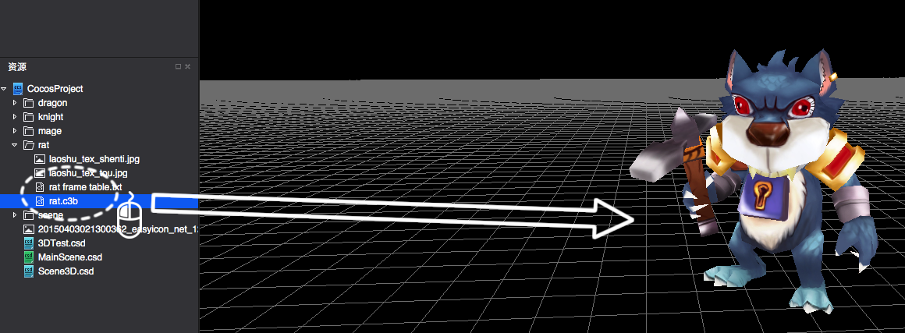

#3D模型控件简介

代表3D场景中一个三维物体的控件，也就是代表了三维世界中的一个三维物体。通过设置3D模型控件的属性和模型贴图来演绎出各种各样的三维物体。

3D模型控件使用方法

1,创建基本3D对象

&emsp;鼠标拖拽3D控件栏的模型控件，拖入到场景中。

 
2,调整对象属性

&emsp;调整基本属性值，或者通过在场景中进行自由变换操作

&emsp;&emsp;

 
3,导入模型并使用

&emsp;把模型,贴图文件导入到工程，然后把模型文件拖到场景使用导入三维资源图示如下：
 
&emsp;&emsp;&emsp;&emsp;&emsp;&emsp;&emsp;&emsp;&emsp;&emsp;,

&emsp;&emsp;&emsp;&emsp;&emsp;&emsp;&emsp;&emsp;&emsp;&emsp;&emsp;&emsp;&emsp;&emsp;&emsp;&emsp;&emsp;&emsp;&emsp;&emsp;&emsp;&emsp;&emsp;&emsp;

 
&emsp;使用模型资源时，直接拖动模型文件到场景就可以使用了，图示如下：

 

