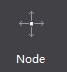
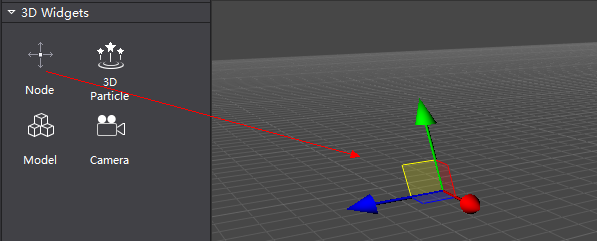
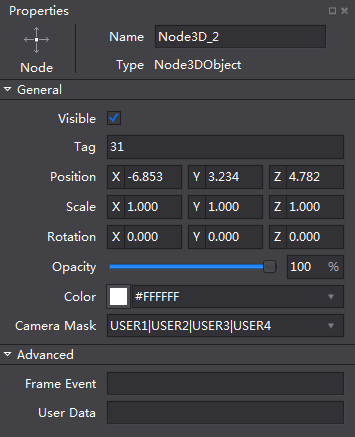

#3D Node Overview

3D nodes mainly have three features: containing other nodes; setting up regular callback; implementing certain behaviors. 

### How to edit 3D nodes ###

1 Create a 3D node.

Drag and drop a 3D node from 3D Objects panel to Scene. 

2 Specify properties for the Object.

In the Properties panel, you can modify some property values, including Name, Visible, Tag, Position, Scale, Rotation, Opacity, Color and Camera Mask. 

3.You can use drag-and-drop operation and shortcut bar at the same time to customize position, scale and rotation settings. 

