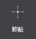
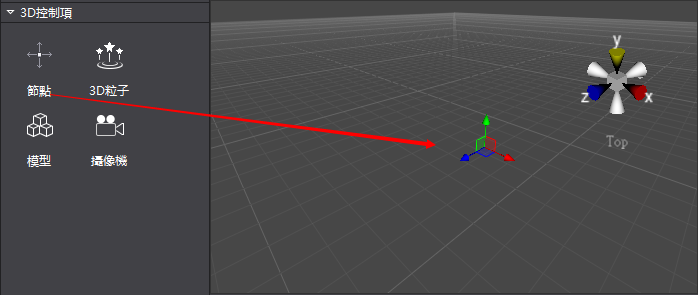
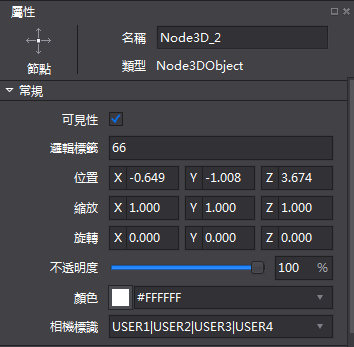
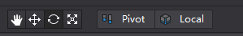
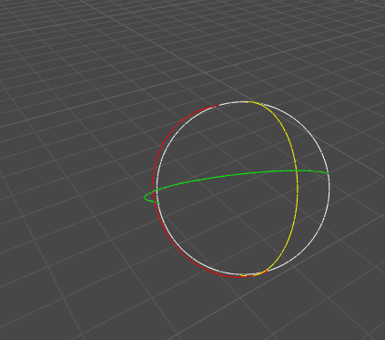

#3D節點簡介

3D節點是3D場景的基本元素，在遊戲製作時，經常需要用節點標記或創建父子關係。節點有三個主要特點：可以包含其他節點物件；可以設置定期回檔；可以執行一些操作。

##3D節點使用方法

###1）創建3D節點

滑鼠拖拽3D控制項欄的節點控制項，拖入到場景中。

###2）調整物件屬性

可以在右側的屬性欄調整基本屬性值，這些屬性值包括：名稱,可見性,邏輯標籤,位置,縮放,旋轉,不透明度,顏色和相機標識。

###3）同時，也可以通過快捷列，結合場景的拖拽等操作，進行節點位置,縮放,旋轉等的操作

