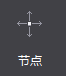
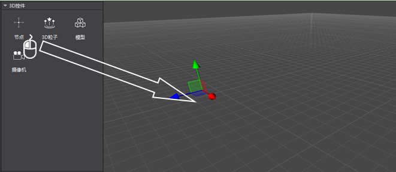
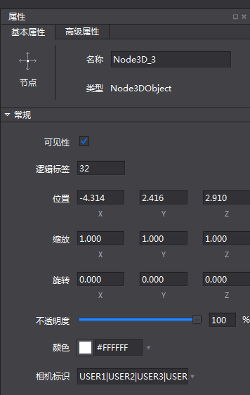

#3D节点简介

3D节点是3D场景的基本元素，在游戏制作时，经常需要用节点标记或创建父子关系。节点有三个主要特点：可以包含其他节点对象；可以设置定期回调；可以执行一些操作。

##3D节点使用方法

###1）创建3D节点

鼠标拖拽3D控件栏的节点控件，拖入到场景中。

###2）调整对象属性

可以在右侧的属性栏调整基本属性值，这些属性值包括：名称,可见性,逻辑标签,位置,缩放,旋转,不透明度,颜色和相机标识。

###3）同时，也可以通过快捷工具栏，结合场景的拖拽等操作，进行节点位置,缩放,旋转等的操作

