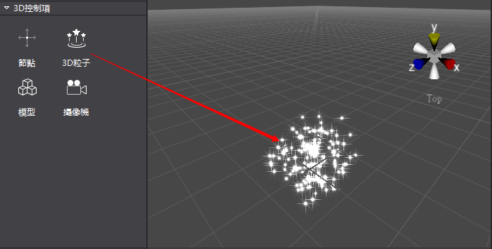
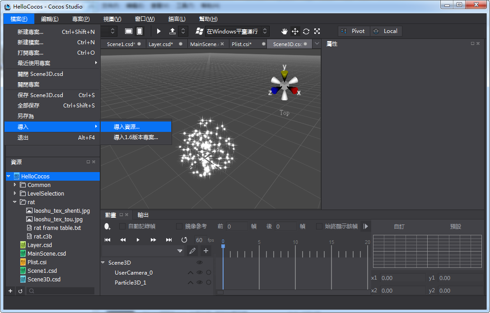
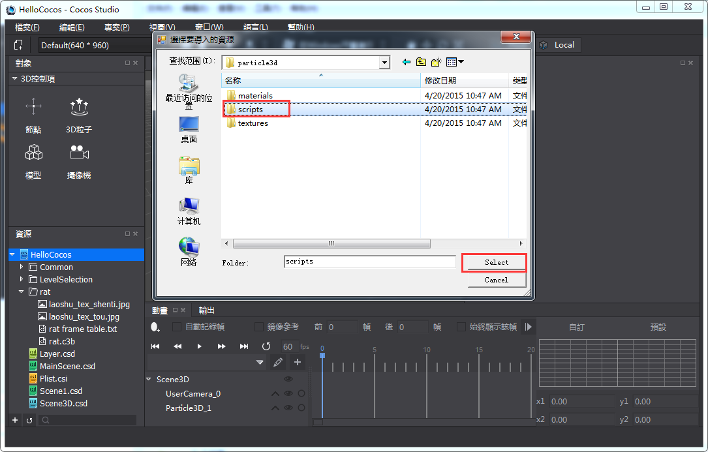
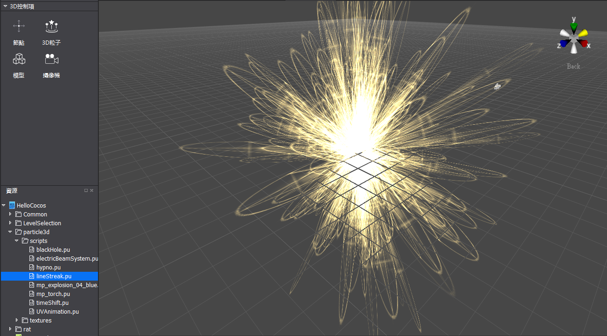

#3D粒子控制項簡介

&emsp;&emsp;將無數的單個粒子組合使其呈現出固定形態，借由控制器，腳本來控制其整體或單個的運動，來模擬現實中的水,火,霧,氣等效果。

3D粒子控制項使用

1,創建3D粒子

&emsp;滑鼠拖拽3D控制項欄的3D粒子，拖入到場景中。

 
2,調整物件屬性

&emsp;調整基本屬性值，或者通過在場景中進行自由變換操作，可以改變屬性的位置,縮放,旋轉等。更多的和粒子自身特性相關的配置參數，使用者需要用粒子編輯軟體例如Particle Universe，進行編輯，然後把編輯好的粒子檔導入到Cocos Studio中使用。

3,導入粒子檔並使用

&emsp;把粒子檔導入到工程，然後把粒子檔拖到場景使用導入粒子資源圖示如下：
 
&emsp;&emsp;

&emsp;&emsp;&emsp;&emsp;&emsp;&emsp;&emsp;&emsp;&emsp;&emsp;&emsp;&emsp;&emsp;&emsp;&emsp;&emsp;

 
&emsp;使用粒子資源時，直接拖動粒子檔到場景就可以使用了，圖示如下：

&emsp;也可以把粒子檔拖到已經創建的粒子特性屬性區，替換粒子檔，替換後原來的粒子呈現粒子檔描述的效果。
