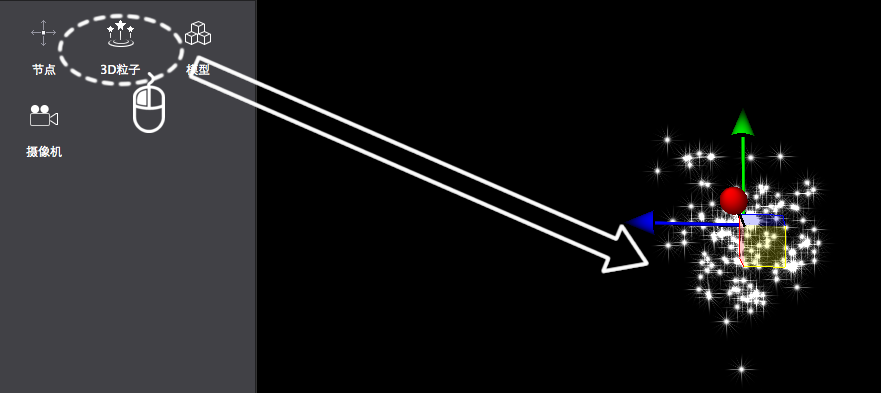
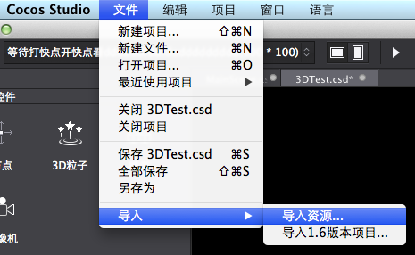
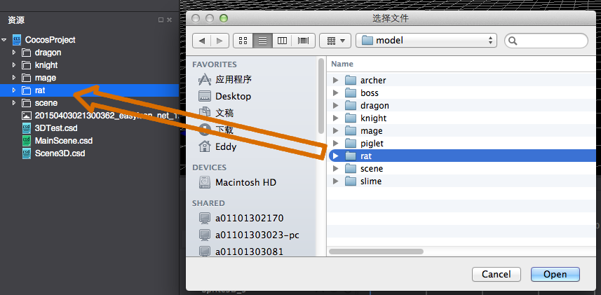
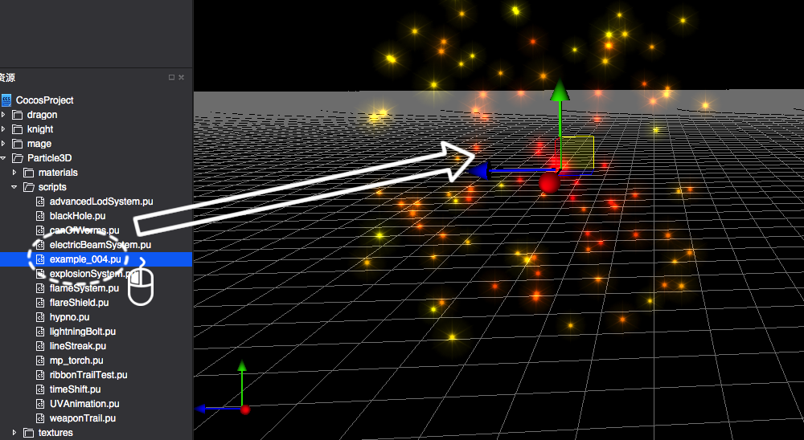

#3D粒子控件简介

&emsp;&emsp;将无数的单个粒子组合使其呈现出固定形态，借由控制器，脚本来控制其整体或单个的运动，来模拟现实中的水,火,雾,气等效果。

3D粒子控件使用

1,创建3D粒子

&emsp;鼠标拖拽3D控件栏的3D粒子，拖入到场景中。

 
2,调整对象属性

&emsp;调整基本属性值，或者通过在场景中进行自由变换操作，可以改变属性的位置,缩放,旋转等。更多的和粒子自身特性相关的配置参数，用户需要用粒子编辑软件例如Particle Universe，进行编辑，然后把编辑好的粒子文件导入到Cocos Studio中使用。

3,导入粒子文件并使用

&emsp;把粒子文件导入到工程，然后把粒子文件拖到场景使用导入粒子资源图示如下：
 
&emsp;&emsp;

&emsp;&emsp;&emsp;&emsp;&emsp;&emsp;&emsp;&emsp;&emsp;&emsp;&emsp;&emsp;&emsp;&emsp;&emsp;&emsp;

 
&emsp;使用粒子资源时，直接拖动粒子文件到场景就可以使用了，图示如下：

&emsp;也可以把粒子文件拖到已经创建的粒子特性属性区，替换粒子文件，替换后原来的粒子呈现粒子文件描述的效果。

