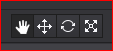
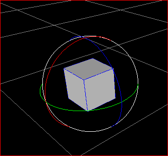

#3D Keyboard Shortcuts 

**Zoom/scale the objects in 3D scene**

1 Select an object, hold down the center mouse wheel  with Shift to scale 3D object in X, Y, and Z axis.   

2 In 3D scene, there is a shortcut bar at the top of the wokrspace. See the following picture. 

&emsp;&emsp;&emsp;&emsp;&emsp;&emsp;&emsp;
 
On Windows: 

- Move the scene with keyboard shortcut Q.  

- Move the selected object with keyboard shortcut W.   

 &emsp;&emsp;&emsp; 
 
- Rotate the selected object with keyboard shortcut E. 

 &emsp;&emsp;&emsp;
 
- Scale the selected object with keyboard shortcut R. 

&emsp;&emsp;&emsp; 
 
**3D Camera Rotation**

Press ALT and left mouse button to orbit the view around the focal point when move the mouse.  