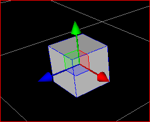
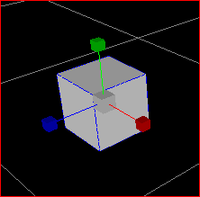

#3D编辑快捷键使用方法

3D缩放场景内物体快捷键

&emsp;按下Shift键同时鼠标滚轮缩放3D物体，则实现在X,Y,Z三个维度上等比例缩放；

&emsp;3D场景下设置4种模式，如下图所示，不同的模式下鼠标拖拽功能不同。

&emsp;&emsp;&emsp;&emsp;&emsp;&emsp;&emsp;&emsp;&emsp;&emsp;&emsp;&emsp;
 
&emsp;&emsp;&emsp;1) 键盘上按下快捷键Q切换到场景模式，鼠标拖拽移动场景；

&emsp;&emsp;&emsp;2) 键盘上按下快捷键W切换到位置模式，场景内拖拽时，改变被选取物体的位置坐标；

 
&emsp;&emsp;&emsp;3) 键盘上按下快捷键E时，切换到旋转模式，场景内拖拽时，旋转被选取物体；

 
&emsp;&emsp;&emsp;4) 键盘上按下快捷键R时，场景内拖拽鼠标，缩放被选中物体。

 
&emsp;相机旋转

&emsp;按下Alt并拖拽鼠标，相机围绕中心点旋转，改变视角。
