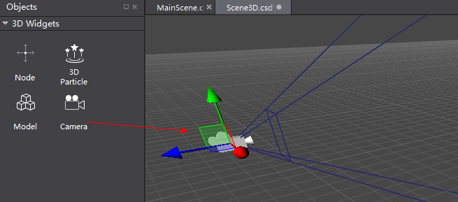
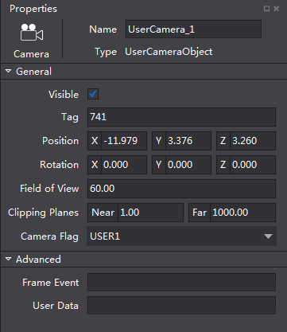
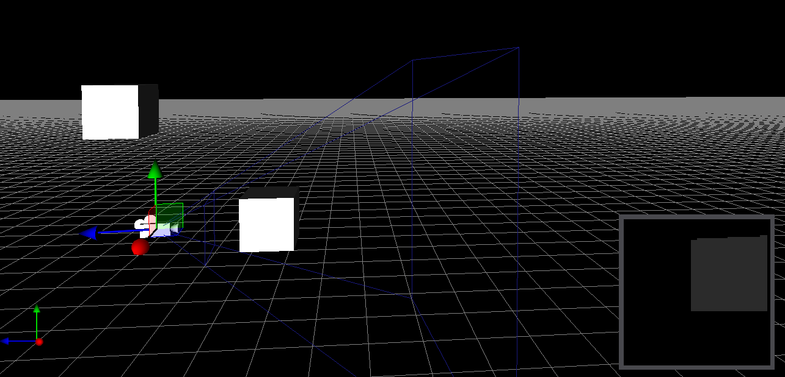

#Camera

Cameras are used to capture and display the world of a game scene. Only the objects within the camera view can be displayed. 

**1 Create a camera** 

Drag and drop Camera from 3D Widgets to Scene. 

 
**2 Modify camera's basic properties**

Modify basic properties in Properties panel, or move and dynamically adjust the camera's position and rotation with mouse. 

&emsp;&emsp;
 
**3 Adjust the camera's frustum**

Objects can be captured by camera when they are within the frustum. For example, in the following picture the bule diverging line defines the frustum, and the box on the left is not visible while the box on the right is visible to the camera.  

Adjust the field of view to control the size of frustum, so that to control what is visible to the camera. The position of far clipping plane and near clipping plane decide what can be captured by the camera. 

