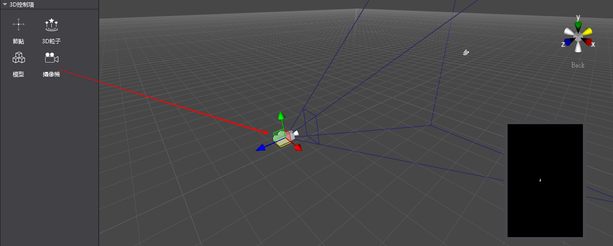
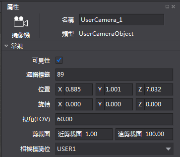

#攝像機控制項簡介

&emsp;&emsp;攝像機是給使用者呈現場景內視圖的視窗，只有在攝像機視區內的場景物體才可以被使用者觀察到。

攝像機控制項使用方法

1,創建攝像機

&emsp;滑鼠拖拽3D控制項欄的攝像機控制項，拖入到場景中。

 
2,調整攝像機屬性基本屬性

&emsp;調整基本屬性值，或者通過在場景中進行自由變換操作可以改變攝像機的位置和旋轉。

&emsp;&emsp;
 
3,調整攝像機視椎體

&emsp;只有落在攝像機視椎體內的物體才可以被看到，如下圖所示藍色視椎範圍為視椎體，第一個方盒不在視椎體內，第二個方盒子在視椎體內，所以攝像機預覽只能看到一個方盒子。

&emsp;調節視角（Fov）來控制視椎體的開口大小，從而可以控制可以觀察的物體；

&emsp;調節剪裁面的遠近值，可以控制視椎體的觀察遠近值，來改變可以觀察的物體；
