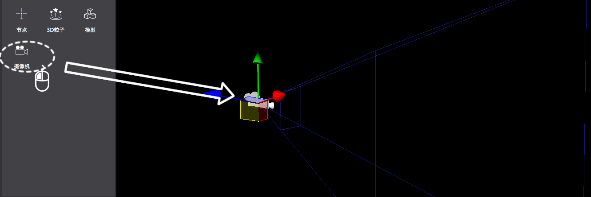
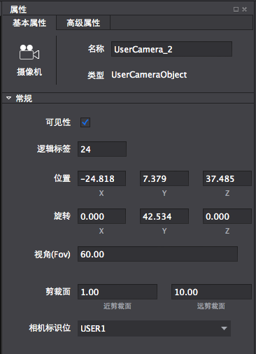

#摄像机控件简介

&emsp;&emsp;摄像机是给用户呈现场景内视图的窗口，只有在摄像机视区内的场景物体才可以被用户观察到。

摄像机控件使用方法

1,创建摄像机

&emsp;鼠标拖拽3D控件栏的摄像机控件，拖入到场景中。

 
2,调整摄像机属性基本属性

&emsp;调整基本属性值，或者通过在场景中进行自由变换操作可以改变摄像机的位置和旋转。

&emsp;&emsp;
 
3,调整摄像机视椎体

&emsp;只有落在摄像机视椎体内的物体才可以被看到，如下图所示蓝色视椎范围为视椎体，第一个方盒不在视椎体内，第二个方盒子在视椎体内，所以摄像机预览只能看到一个方盒子。

&emsp;调节视角（Fov）来控制视椎体的开口大小，从而可以控制可以观察的物体；

&emsp;调节剪裁面的远近值，可以控制视椎体的观察远近值，来改变可以观察的物体；

