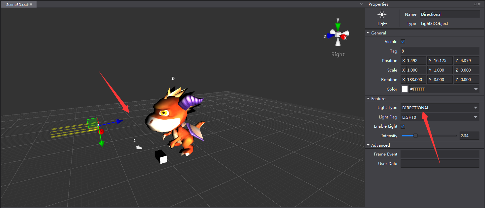
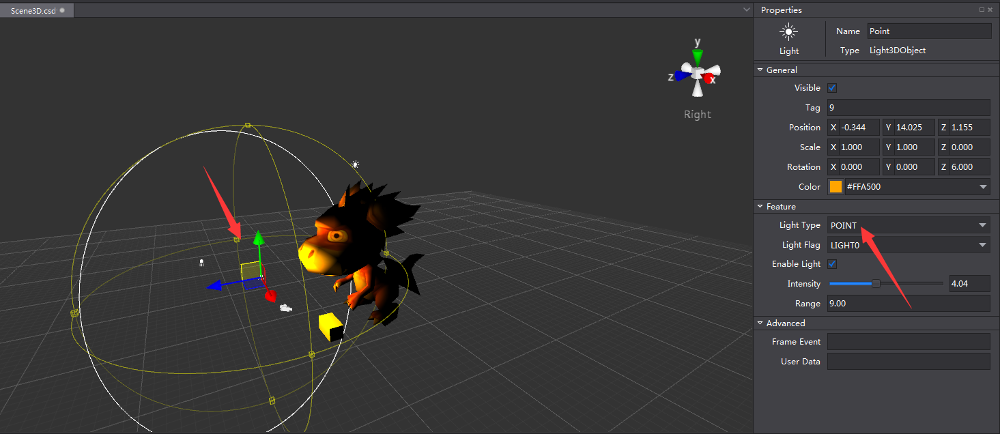
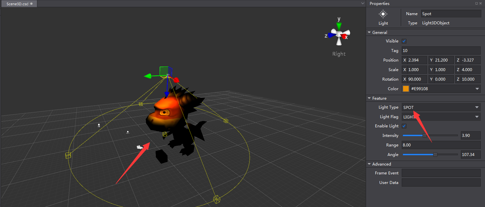
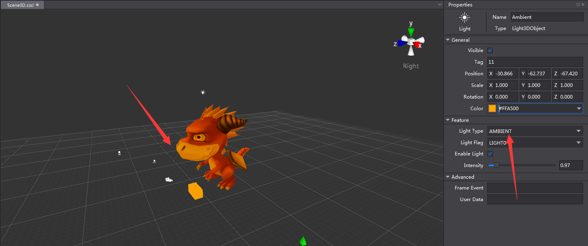
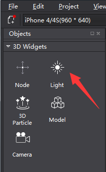
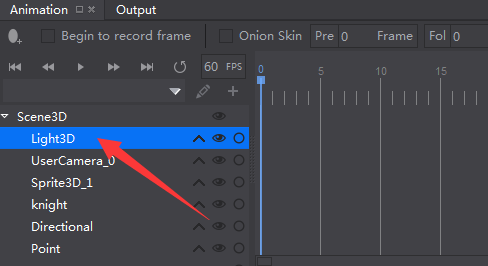
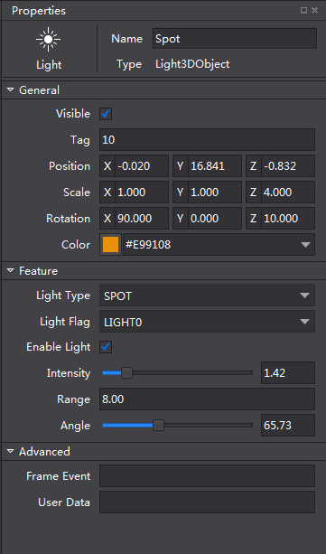
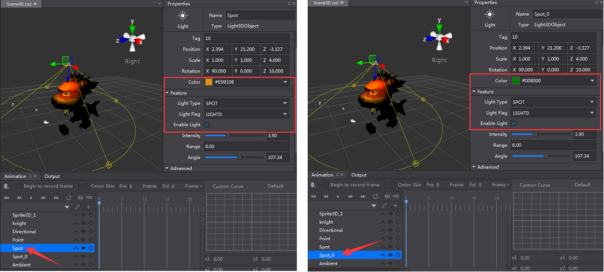

# 3D Light #

Currently four 3D lighting techniques are supported in cocos, which are Directional Light, Point Light, Spot Light and Ambient Light. 

Directional Light provides parallel light from one direction. It is often used to simulate light from one direction. 

Point Light emits light in all directions equally from a central spot. Objects within the sphere can be lighted. 

Spot Light provides light from a single point in a cone shape. Objects within the cone area can be affected. It is often used to simulate the effect of lamps. 

Ambient Light is used to light up the whole scene evenly. It has no specific direction of the light source. 

### Add Light ###

Drag Light from 3D Widgets to a 3D scene.

&emsp;&emsp;&emsp;&emsp;

### Modify Light Properties###

Select the Light in the structure tree. 

&emsp;&emsp;&emsp;&emsp;

Modify the properties of the seleted object. 

&emsp;&emsp;&emsp;&emsp;

### Notes of Light Properties ###

1. General properties of light include Visible, Tag, Position, Scale, Rotation and color. 

2. Within the Feature tab, you can modify Light Type, Light Flag, whether enable light, values of Intensity, Range and Angle. 

3. The intensity ranges from 0-10.

4. Range is used to modify the radius of Point Light and the height of the cone of the Spot Light.

5. Angle is used to adjust the cone angle of the Spot Light.  

6. Object in the scene can only be affected by one directional light, one point light and one spot light. The effects of Ambient Light can be mixed.  

    - When there are more than one directional light/ point light/ spot light, and all are enabled, objects will only be affected by the light with same light flag. 

    - When there are more than one light of the same type and same light flag, objects will be affected by the light at the top of the structure tree. In the following example, object is lighted by Spot but Spot_0. 

&emsp;&emsp;