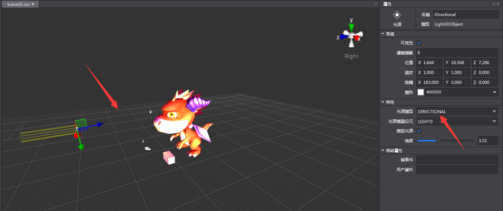
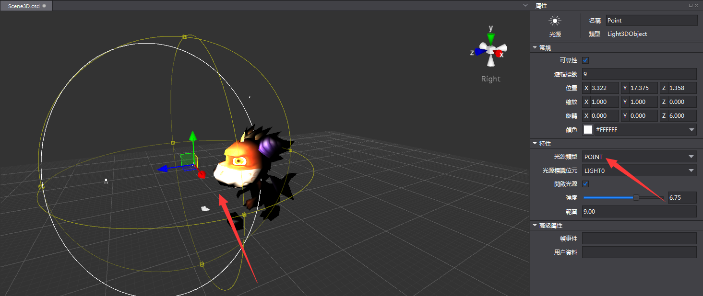
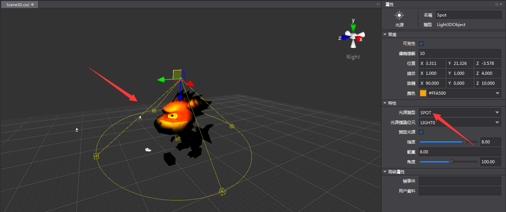
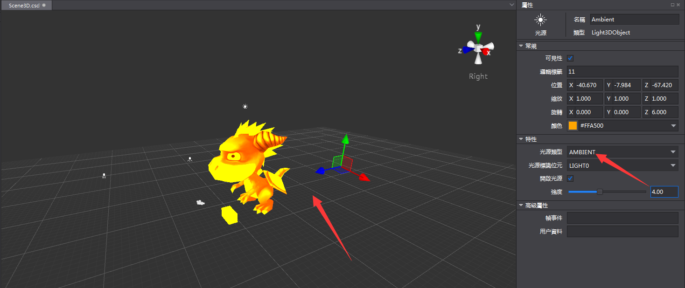
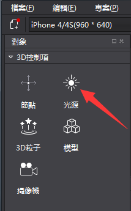
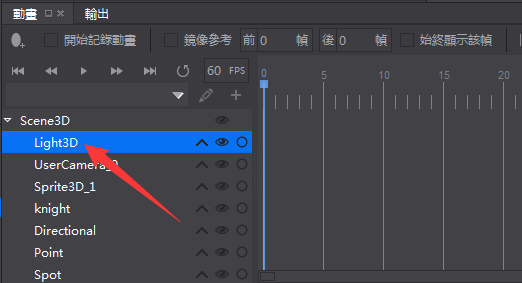
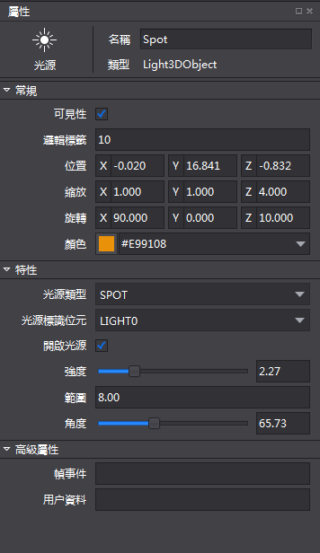
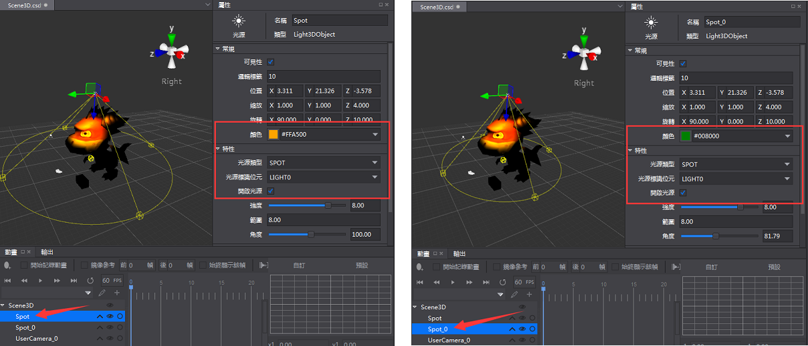

# 3D 燈光簡介 #

Cocos 提供了四種光源類型：平行光（Directional），點光源（Point），聚光燈（Spot）和環境光（Ambient）。

平行光：提供平行的照明範圍，通常用於模擬方向光。

點光源：以光源位置為圓心的球形光照，在球形半徑之內的物體，才會收到其光照影響。

聚光燈：根據角度和範圍定義一個圓錐體照射位於椎體內的物件，通常用於類比路燈，車燈等效果。

環境燈：照亮整個場景的常規光線。這種光具有均勻的強度，並且屬於均質漫反射。它不具有可辨別的光源和方向。

### 創建光源 ###

從3D控制項區，拖拽光源控制項到3D場景。

&emsp;&emsp;&emsp;&emsp;

### 設置光源屬性###

在動畫面板的結構樹中，選中光源。

&emsp;&emsp;&emsp;&emsp;

在屬性區對選中的光源參數進行設置修改。

&emsp;&emsp;&emsp;&emsp;

### 燈光屬性說明 ###

1. 在常規屬性區，調整基本屬性值，或者通過在場景中進行自由變換操作，可以改變燈光的位置，縮放，旋轉和顏色。

2. 在特性區，可以選擇光源類型，修改光源標識位元，設置是否開啟光源，調整強度，範圍以及角度值。

3. 光線強度的調整範圍為0-10。

4. 範圍值用於調整點光源的球形半徑，聚光燈圓錐體的高度。

5. 角度值用於調整聚光燈圓錐體的角度。

6. 場景中物體只會同時被一個平行光，一個點光源，一個聚光燈所影響，環境光疊加多個。

    - 當場景中有多個平行光/點光源/聚光燈，並設置為開啟時，物體只會被與它具有相同光源標識位元的光源影響。

    - 當場景中同一類型的光源（平行光，點光源或聚光燈）有多個相同的光源標識位元時，則按照物件結構樹的控制項的順序，被最上面的光源影響。例如在下圖所示的情況中，物體被Spot光源影響。 

&emsp;&emsp;
