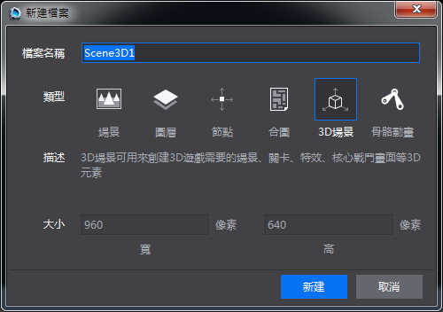
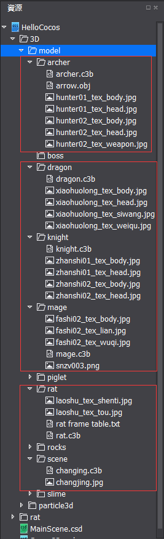
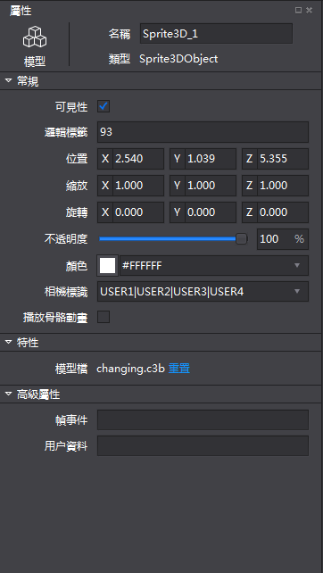
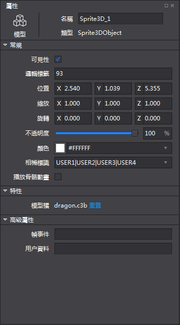
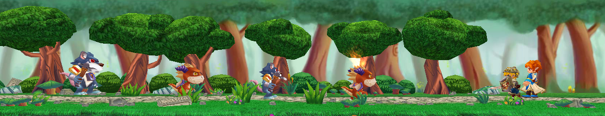
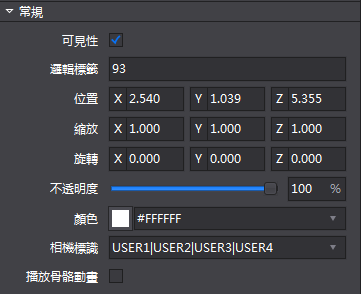
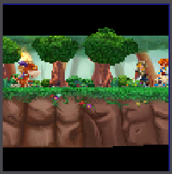

#創建3D場景
1）    創建場景文件

&emsp;&emsp;點擊“檔”功能表->新建檔，選擇3D場景並輸入檔案名Testscene。如下圖所示：

&emsp;&emsp; 

2）    導入編輯場景需要用到的模型資源

&emsp;&emsp;如下圖所示，其中用紅色虛線框選的內容為本次場景實例需要用到的素材。如果讀者沒有這裡所述的資源，可以用別的符合要求的模型檔替代，但操作方法相同。

&emsp;&emsp; 

3）    擺放場景資源

&emsp;&emsp;i.拖入Scene資料夾下的changing.c3b到場景，在選中狀態下配置屬性資訊如下：

&emsp;&emsp; 
 
&emsp;&emsp;ii.拖入dragon資料夾下的dragon.c3b到場景，然後在選中狀態下配置屬性資訊如下：

&emsp;&emsp; 

&emsp;&emsp;iii.重複以上兩個步驟，放入knight.c3b,mage.c3b和rat.c3b並配置其常規屬性，得出如下圖的場景。

&emsp;&emsp; 
 
&emsp;&emsp;iv.創建一個攝像機，並配置攝像機的常規屬性如下：

&emsp;&emsp; 
 
&emsp;&emsp;v.我們通過配置好的攝像機鏡頭就可以看到一個粗略的遊戲場景了，如下圖所示：

&emsp;&emsp; 
 
&emsp;&emsp;vi.把此場景發佈到cocos工程，然後通過增加代碼控制就可以實現一個簡單的英雄打怪的遊戲了。
