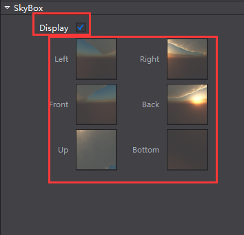
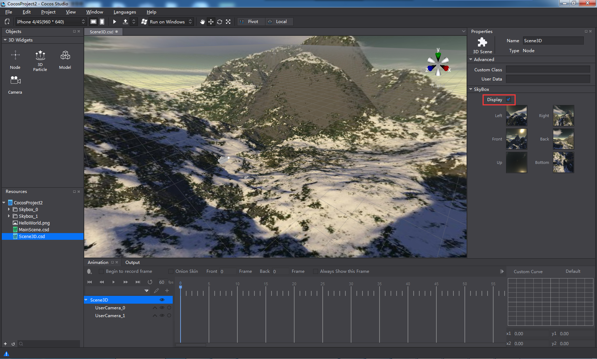
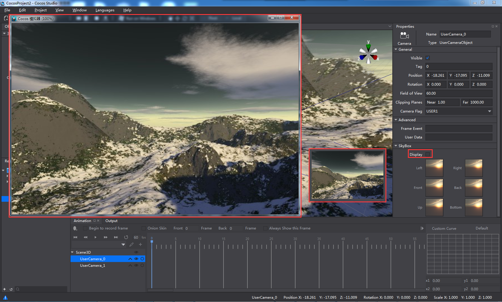
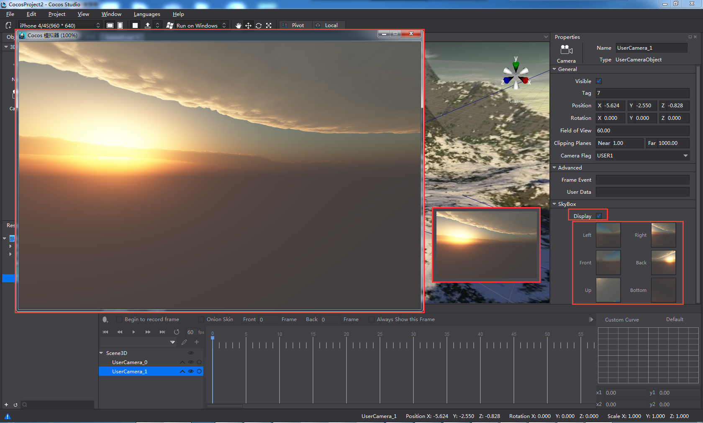
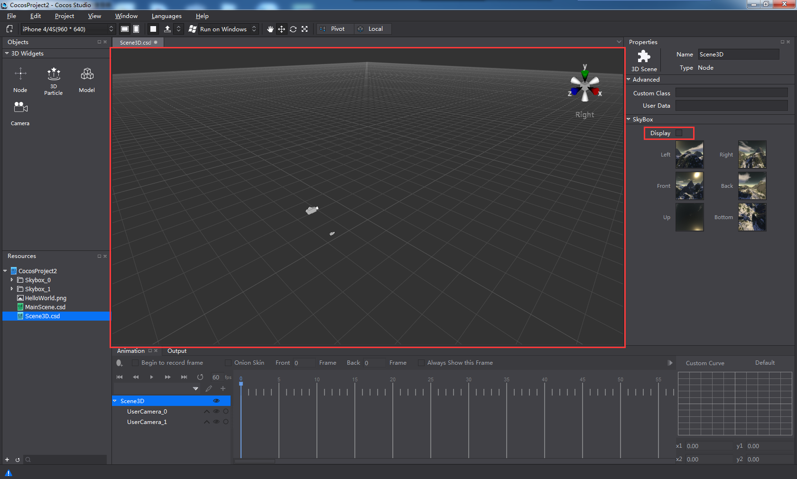
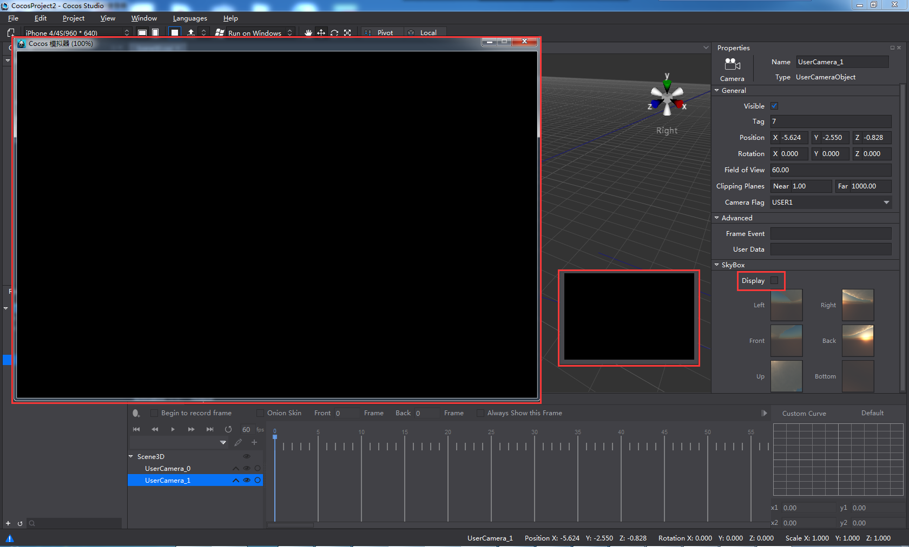
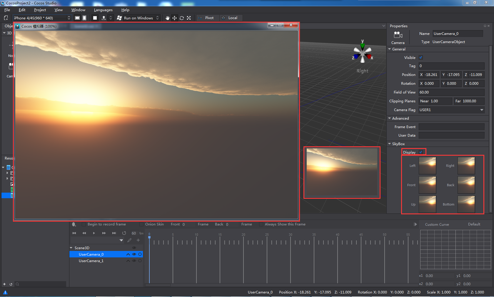
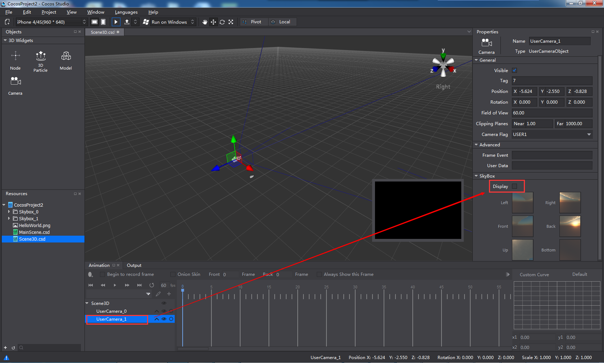

#Skybox

Skybox is a technique used to create a sphere with textures drawn around the scene or the camera. It helps to create an environment infinitely far away, such as a blue sky with white clouds or a dark sky with stars. 

How to create a skybox

1. To enable Skybox. Check the Display option in the Skybox tab under Properties panel. Skybox can be attached to the root node of a 3D scene and cameras. 

2. Assign six pictures (jpg, png) to the skybox, including Left, Right, Front, Back, Up and Bottom. Match the pictures to the direction they represent. 

&emsp;&emsp;

3. Display of skybox. 

&emsp;&emsp;a. When Skybox is enabled for the root node. 

&emsp;&emsp;

- If  the skybox is disabled for all the cameras, skybox of the scene (root node) will be displayed in rendering section, camera preview window and simulator.  

&emsp;&emsp;

- If  the skybox is enabled for multiple cameras, selecting one of these cameras, skybox of these camera will be displayed in camera preview window. 

&emsp;&emsp;

- If the skybox is enabled for multiple cameras, selecting one camera that skybox is unchecked, skybox of the scene (root node) will be displayed in camera preview window, while skybox of a higher level camera (node at the bottom) will be displayed in simulator. 

&emsp;&emsp;b. When Skybox is not checked to display for the root node. 

&emsp;&emsp;

- If the skybox is disabled for all the cameras, skybox cannot be previewed in rendering section, camera preview window and simulator. 

&emsp;&emsp;

- If the skybox is enabled for multiple cameras, selecting one of these cameras, skybox of the camera will be displayed in camera preview window. 

&emsp;&emsp;

- If the skybox is enabled for multiple cameras, selecting one camera that skybox is unchecked, nothing will be displayed in camera preview window, and skybox of a higher level camera (which Skybox is checked to display) will be displayed in simulator. 

&emsp;&emsp; 

*Note: Only when the 6 sides of the skybox are assigned with pictures, can the skybox display. The six pictures should be same in size, filename extension and coding format.*
