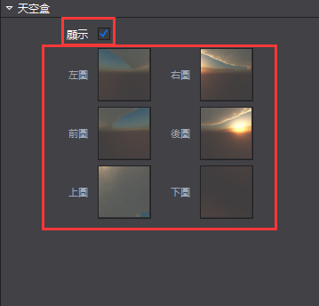
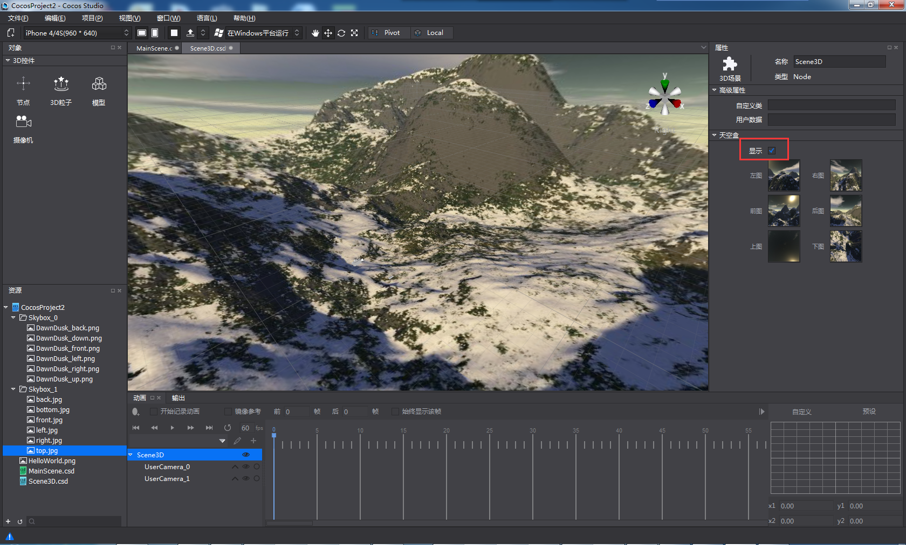
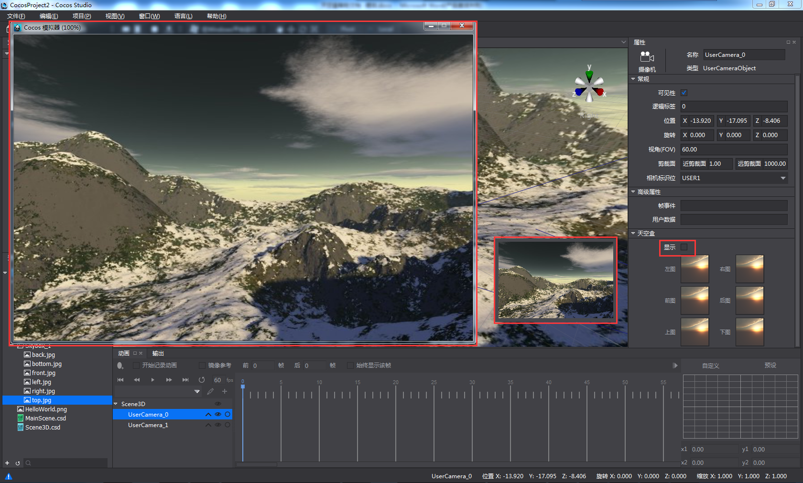
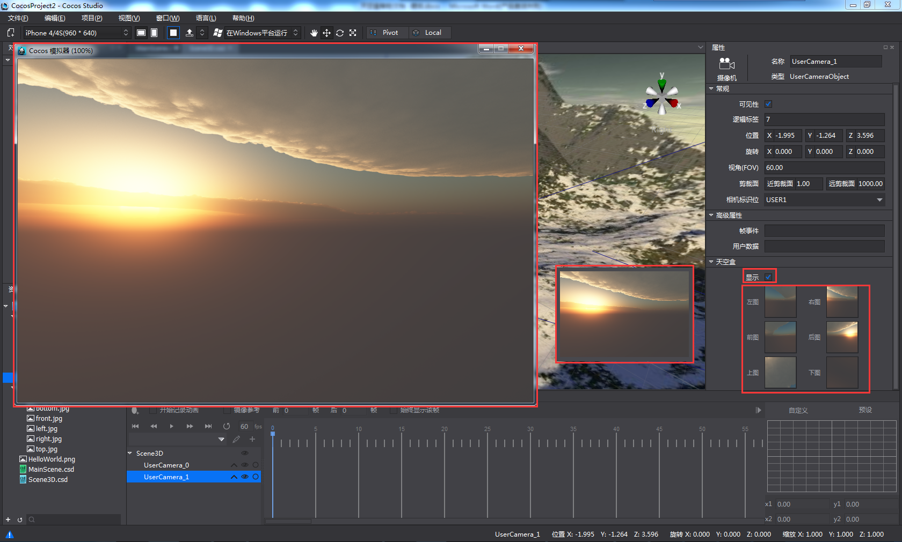
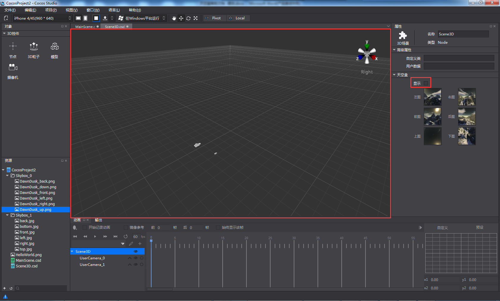
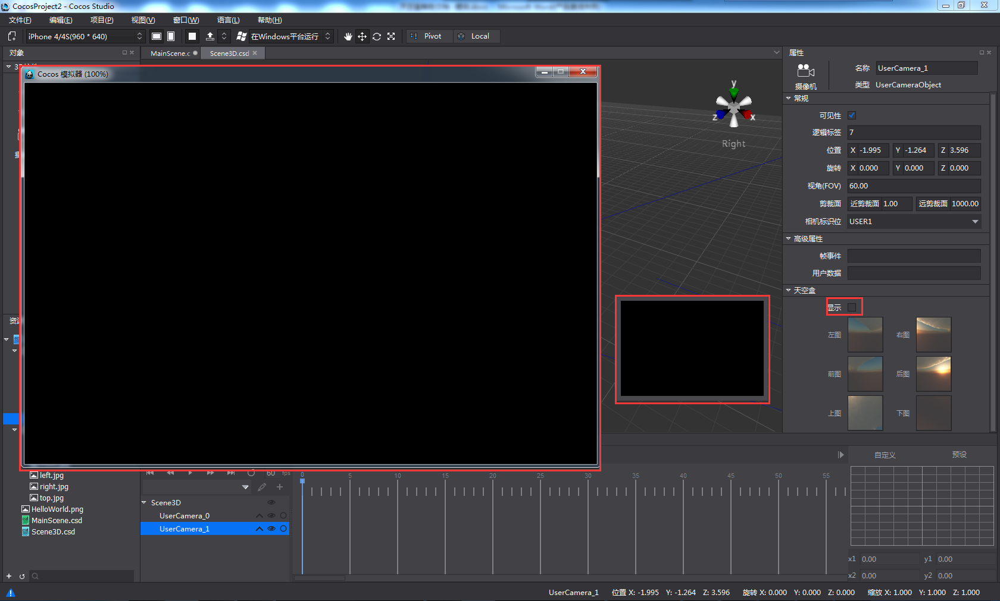
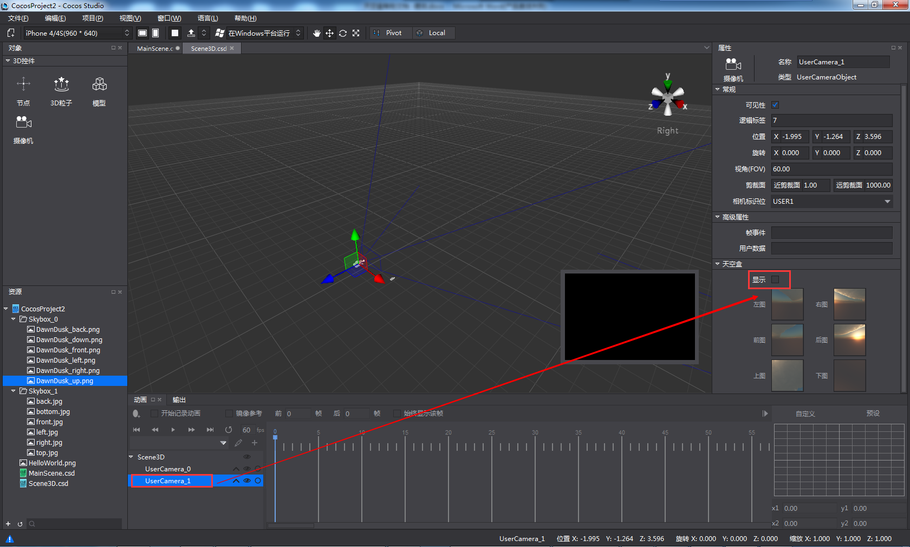
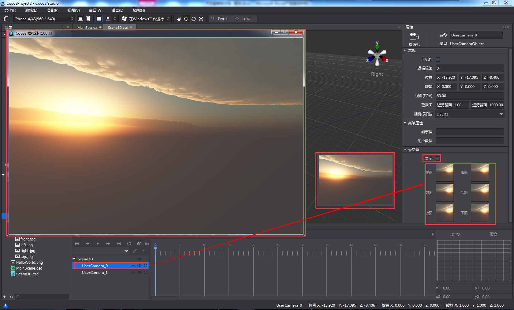

#天空盒

&emsp;&emsp;天空盒是一種特殊的材質，該材質可以籠罩在整個場景之外或者攝像機之外來模擬類似天空之類的效果。如，繁星滿天,藍天白雲和月夜等。

天空盒用法

（1）    在屬性面板-天空盒：勾選開啟天空盒功能（3D場景根節點和攝像機包含天空盒組件）

（2）    將屬性區天空盒分頁的左圖,右圖,前圖,後圖,上圖,下圖分別添加圖片資源（jpg, png）

         
（3）    天空盒的顯示

&emsp;&emsp;當根節點勾選天空盒屬性時：

&emsp;&emsp;1.若攝像機（一個/多個）中未勾選天空盒時，渲染區,攝像機小視窗,模擬器中均顯示場景（根節點）的天空盒；

&emsp;&emsp;2.若攝像機（一個/多個）中全部勾選或部分勾選天空盒屬性時，選中勾選天空盒的某個攝像機，攝像機小視窗中將顯示該攝像機的天空盒，選中未勾選天空盒的攝像機其攝像機小視窗仍顯示場景（根節點）的天空盒，模擬器中顯示渲染層級最高（結構樹位置最靠下）的攝像機小視窗的效果。

&emsp;&emsp;當根節點未勾選天空盒屬性時：

&emsp;&emsp;1.若攝像機（一個/多個）中未勾選天空盒時，渲染區,攝像機小視窗,模擬器中均不顯示天空盒；

&emsp;&emsp;2.若攝像機（一個/多個）中全部勾選或部分勾選天空盒屬性時，選中勾選天空盒的某個攝像機，攝像機小視窗中將顯示該攝像機的天空盒，選中未勾選天空盒的攝像機其攝像機不顯示天空盒，模擬器中顯示渲染層級最高（結構樹位置最靠下）勾選天空盒的攝像機的效果。

 

 
&emsp;&emsp;注意：天空盒的左圖,右圖,前圖,後圖,上圖,下圖的圖片資源的大小,圖片格式,編碼格式必須一致，且六個屬性必須全部添加資源才能顯示。
