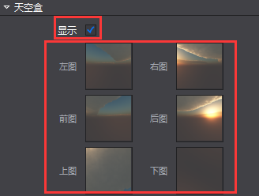

#天空盒

&emsp;&emsp;天空盒是一种特殊的材质，该材质可以笼罩在整个场景之外或者摄像机之外来模拟类似天空之类的效果。如，繁星满天,蓝天白云和月夜等。

天空盒用法

（1）	在属性面板-天空盒：勾选开启天空盒功能（3D场景根节点和摄像机包含天空盒组件）

（2）	将属性区天空盒分页的左图,右图,前图,后图,上图,下图分别添加图片资源（jpg, png）

         
（3）	天空盒的显示

&emsp;&emsp;当根节点勾选天空盒属性时：

&emsp;&emsp;1.若摄像机（一个/多个）中未勾选天空盒时，渲染区,摄像机小窗口,模拟器中均显示场景（根节点）的天空盒；

&emsp;&emsp;2.若摄像机（一个/多个）中全部勾选或部分勾选天空盒属性时，选中勾选天空盒的某个摄像机，摄像机小窗口中将显示该摄像机的天空盒，选中未勾选天空盒的摄像机其摄像机小窗口仍显示场景（根节点）的天空盒，模拟器中显示渲染层级最高（结构树位置最靠下）的摄像机小窗口的效果。

&emsp;&emsp;当根节点未勾选天空盒属性时：

&emsp;&emsp;1.若摄像机（一个/多个）中未勾选天空盒时，渲染区,摄像机小窗口,模拟器中均不显示天空盒；

&emsp;&emsp;2.若摄像机（一个/多个）中全部勾选或部分勾选天空盒属性时，选中勾选天空盒的某个摄像机，摄像机小窗口中将显示该摄像机的天空盒，选中未勾选天空盒的摄像机其摄像机不显示天空盒，模拟器中显示渲染层级最高（结构树位置最靠下）勾选天空盒的摄像机的效果。

 

 
&emsp;&emsp;注意：天空盒的左图,右图,前图,后图,上图,下图的图片资源的大小,图片格式,编码格式必须一致，且六个属性必须全部添加资源才能显示。

