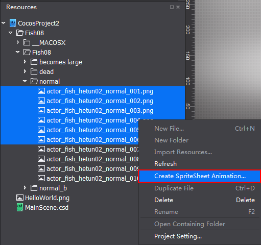
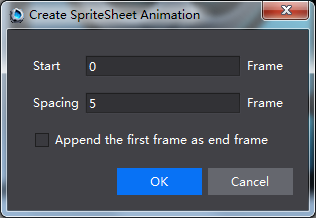
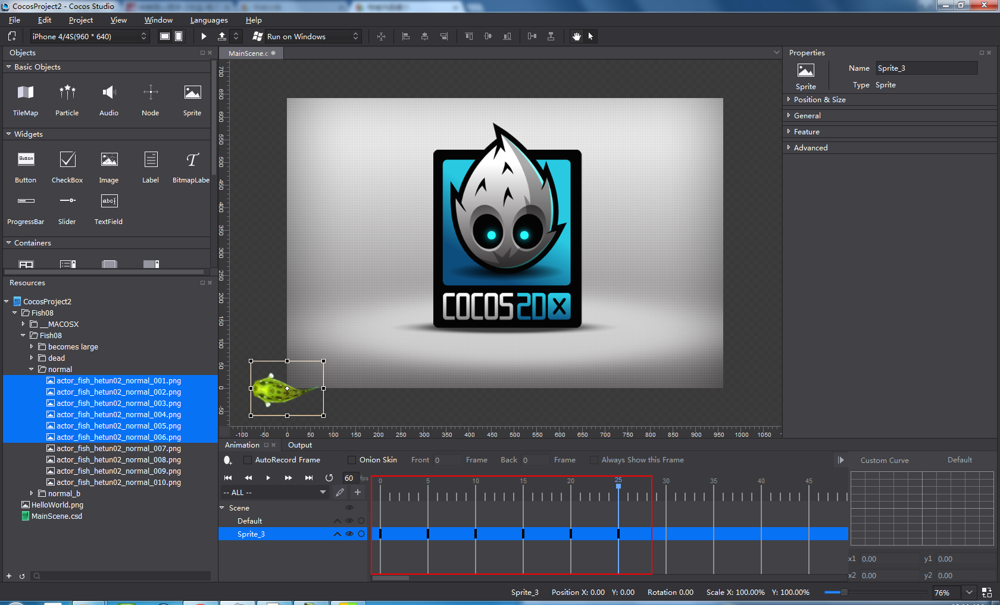
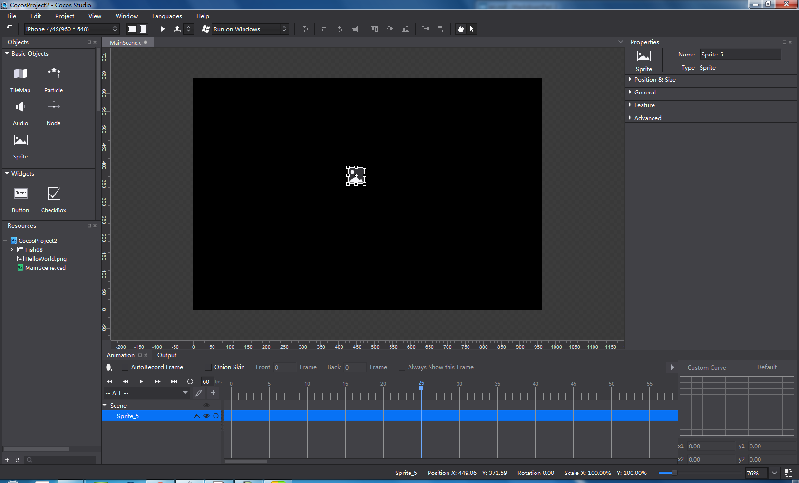
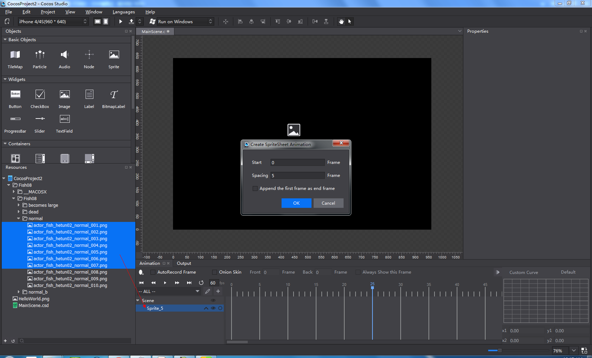
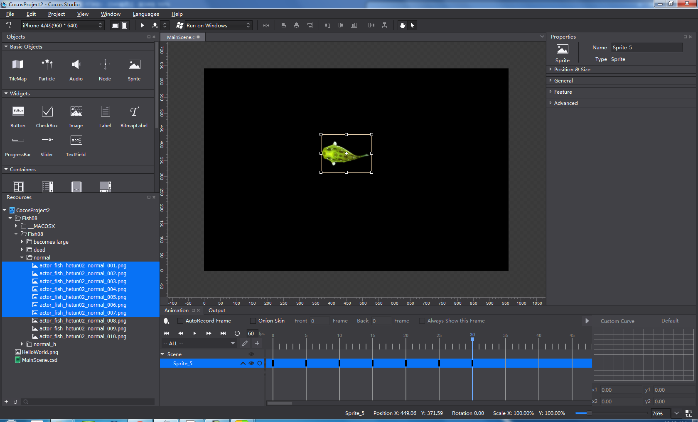

#Create 2D SpriteSheet Animation 

You can create 2D SpriteSheet Animation with cocos in two ways. 

1 Select two or more image resources in Resources panel -> right click and select "create SpriteSheet animation". 

Adjust the Start Frame and Spacing between frames in the following dialog box. To make a smooth animation, cocos has created a function called "Append start frame as end frame", which means that to add a duplicate frame of the start frame as the last one.   

Click OK to create the animation. 

2 Add a Sprite to Canvas

Select two or more images resources in Resources panel, drag and drop them to the Sprite hierarchy tree. 

Set the "Start Frame", "Spacing" and "Append the start frame as end frame", click OK. 

